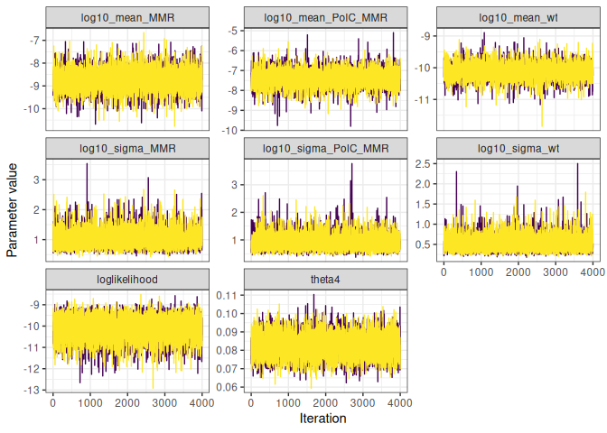
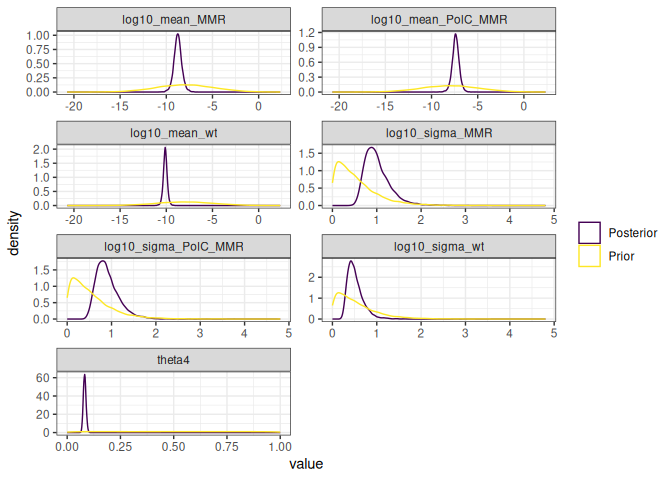

Mutation Accumulation Experiments
================

- [Installation](#installation)
- [Data format](#data-format)
- [Fitting the GCM model](#fitting-the-gcm-model)
  - [Accessing posterior samples](#accessing-posterior-samples)
  - [Various MCMC and model checks](#various-mcmc-and-model-checks)
- [Fitting the model with
  saturation](#fitting-the-model-with-saturation)
  - [Accessing posterior samples](#accessing-posterior-samples-1)
  - [Various MCMC and model checks](#various-mcmc-and-model-checks-1)

<!-- README.md is generated from README.Rmd. Please edit that file -->

This is a package to analyse data generated from Mutation Accumulation
Experiments.

# Installation

Clone the repository on your computer using

    git clone git@forgemia.inra.fr:konkam/MutAccExperiments.git

or

    git clone https://forgemia.inra.fr/konkam/MutAccExperiments.git

You should then install the present package on your computer, using a
command such a the following, from inside the package folder:

    Rscript -e "devtools::install_local('.')"

Alternatively, you may open the folder using the Rstudio editor and
press `Ctrl + Alt + B`.

- Dependencies should be:
  - R package devtools
  - JAGS + the R package RJags (On ubuntu, jags is on the canonical
    repository, available by apt install jags)
  - R package tidyverse
  - R package coda
  - A functioning latex installation
  - cmake

# Data format

``` r
library(MutAccExperiments)
library(tidyverse)
#> ── Attaching core tidyverse packages ──────────────────────── tidyverse 2.0.0 ──
#> ✔ dplyr     1.1.4     ✔ readr     2.1.5
#> ✔ forcats   1.0.0     ✔ stringr   1.5.1
#> ✔ ggplot2   3.5.1     ✔ tibble    3.2.1
#> ✔ lubridate 1.9.4     ✔ tidyr     1.3.1
#> ✔ purrr     1.0.2     
#> ── Conflicts ────────────────────────────────────────── tidyverse_conflicts() ──
#> ✖ dplyr::filter() masks stats::filter()
#> ✖ dplyr::lag()    masks stats::lag()
#> ℹ Use the conflicted package (<http://conflicted.r-lib.org/>) to force all conflicts to become errors
```

``` r
input_data = read.delim(file = "data-raw/SAT_mcmc_chain_labmut_R3610MMR-3610_inputfile.csv", sep = " ")
```

The minimum data required to run the analysis is a data frame with the
following columns:

``` r
minimal_input_data_onestrain = input_data %>% 
  filter(strain == first(strain)) %>% 
  rename(mutation_type = context_id,
         m = m_sc, 
         n = n_c,
         t = t_s) %>% 
  select(mutation_type, m, n, t) 
minimal_input_data_onestrain
#>   mutation_type   m       n      t
#> 1             1 118 1661176 251000
#> 2             2  23 1661176 251000
#> 3             3   8 1661176 251000
#> 4             4 120 2133850 251000
#> 5             5  25 2133850 251000
#> 6             6  25 2133850 251000
```

``` r
minimal_input_data_onestrain %>% 
  check_input_format_GCM()
#> [1] "All good!"
```

# Fitting the GCM model

``` r
fit_GCM_model = minimal_input_data_onestrain %>% 
  EstimateMusGCM_onestrain()
#> Compiling model graph
#>    Resolving undeclared variables
#>    Allocating nodes
#> Graph information:
#>    Observed stochastic nodes: 6
#>    Unobserved stochastic nodes: 17
#>    Total graph size: 75
#> 
#> Initializing model
#> Warning: No initial value blocks found and n.chains not specified: 2 chains
#> were used
#> Warning: No initial values were provided - JAGS will use the same initial
#> values for all chains
#> 
#> Auto-run JAGS
#> 
#> Running a pilot chain...
#> Compiling rjags model...
#> Calling the simulation using the rjags method...
#> Adapting the model for 1000 iterations...
#> Burning in the model for 4000 iterations...
#> Running the model for 10000 iterations...
#> Simulation complete
#> Finished running the simulation
#> 
#> Calculating the Gelman-Rubin statistic for 18 variables....
#> The Gelman-Rubin statistic is below 1.05 for all parameters
#> 
#> Calculating the necessary sample length based on the Raftery and
#> Lewis's diagnostic...
#> Indicated sample length achieved
#> Auto-run JAGS complete
```

## Accessing posterior samples

``` r
extract_posterior_samples(fit_GCM_model, type = "mu")
#> # A tibble: 8,000 × 8
#>    `log10_mu[1]` `log10_mu[2]` `log10_mu[3]` `log10_mu[4]` `log10_mu[5]`
#>            <dbl>         <dbl>         <dbl>         <dbl>         <dbl>
#>  1         -9.49         -10.2         -10.7         -9.65         -10.4
#>  2         -9.58         -10.3         -10.9         -9.67         -10.3
#>  3         -9.54         -10.3         -10.7         -9.66         -10.3
#>  4         -9.58         -10.4         -10.7         -9.74         -10.3
#>  5         -9.48         -10.3         -10.9         -9.68         -10.4
#>  6         -9.61         -10.3         -10.7         -9.64         -10.5
#>  7         -9.59         -10.4         -10.6         -9.63         -10.2
#>  8         -9.57         -10.4         -10.4         -9.69         -10.5
#>  9         -9.54         -10.3         -10.7         -9.67         -10.2
#> 10         -9.57         -10.2         -10.8         -9.64         -10.1
#> # ℹ 7,990 more rows
#> # ℹ 3 more variables: `log10_mu[6]` <dbl>, iteration <int>, chain_id <int>
```

``` r
extract_posterior_samples(fit_GCM_model, type = "hyperparameters")
#> # A tibble: 8,000 × 5
#>    log10_sigma log10_mean loglikelihood iteration chain_id
#>          <dbl>      <dbl>         <dbl>     <int>    <int>
#>  1       0.410     -10.0          -20.2         1        1
#>  2       0.667     -10.2          -17.9         2        1
#>  3       0.511      -9.90         -17.3         3        1
#>  4       0.582     -10.3          -20.3         4        1
#>  5       0.452     -10.4          -19.6         5        1
#>  6       0.530      -9.95         -21.7         6        1
#>  7       0.257     -10.1          -19.6         7        1
#>  8       0.317     -10.2          -21.7         8        1
#>  9       0.437      -9.95         -18.4         9        1
#> 10       0.460     -10.1          -19.7        10        1
#> # ℹ 7,990 more rows
```

``` r
extract_posterior_samples(fit_GCM_model, type = "predictive")
#> # A tibble: 8,000 × 8
#>    `m_pred[1]` `m_pred[2]` `m_pred[3]` `m_pred[4]` `m_pred[5]` `m_pred[6]`
#>          <dbl>       <dbl>       <dbl>       <dbl>       <dbl>       <dbl>
#>  1         144          39           7         106          26          33
#>  2         105          38           7         104          30          28
#>  3         133          22           6         131          30          23
#>  4         114          20          12         104          22          24
#>  5         138          19           5         109          17          26
#>  6         106          20           9         127          17          39
#>  7         115          14          13         130          38          16
#>  8         118          26          14         114          15          20
#>  9         128          19          11         105          29          18
#> 10         123          25           9         129          18          16
#> # ℹ 7,990 more rows
#> # ℹ 2 more variables: iteration <int>, chain_id <int>
```

``` r
extract_posterior_samples(fit_GCM_model, type = "prior")
#> # A tibble: 8,000 × 5
#>    log10_mean_prior log10_sigma_prior log10_mu_prior iteration chain_id
#>               <dbl>             <dbl>          <dbl>     <int>    <int>
#>  1           -11.4              1.83          -11.2          1        1
#>  2            -7.31             0.600          -7.68         2        1
#>  3            -6.63             0.778          -6.72         3        1
#>  4            -6.20             0.108          -7.06         4        1
#>  5            -9.90             0.139          -9.32         5        1
#>  6           -11.8              0.207         -12.1          6        1
#>  7           -11.4              0.221         -11.5          7        1
#>  8            -7.32             1.16           -7.49         8        1
#>  9            -8.95             0.193          -9.59         9        1
#> 10            -9.97             0.386          -9.37        10        1
#> # ℹ 7,990 more rows
```

Note that the m_pred variables are samples from the posterior predictive
distribution evaluated at the observed data points.

The variables with a suffix “\_prior” are samples from the prior
distribution.

You can also access the posterior samples at once:

``` r
extract_posterior_samples(fit_GCM_model)
#> # A tibble: 8,000 × 20
#>    iteration `m_pred[1]` `m_pred[2]` `m_pred[3]` `m_pred[4]` `m_pred[5]`
#>        <int>       <dbl>       <dbl>       <dbl>       <dbl>       <dbl>
#>  1         1         144          39           7         106          26
#>  2         2         105          38           7         104          30
#>  3         3         133          22           6         131          30
#>  4         4         114          20          12         104          22
#>  5         5         138          19           5         109          17
#>  6         6         106          20           9         127          17
#>  7         7         115          14          13         130          38
#>  8         8         118          26          14         114          15
#>  9         9         128          19          11         105          29
#> 10        10         123          25           9         129          18
#> # ℹ 7,990 more rows
#> # ℹ 14 more variables: `m_pred[6]` <dbl>, `log10_mu[1]` <dbl>,
#> #   `log10_mu[2]` <dbl>, `log10_mu[3]` <dbl>, `log10_mu[4]` <dbl>,
#> #   `log10_mu[5]` <dbl>, `log10_mu[6]` <dbl>, log10_mean <dbl>,
#> #   log10_sigma <dbl>, log10_mean_prior <dbl>, log10_sigma_prior <dbl>,
#> #   log10_mu_prior <dbl>, loglikelihood <dbl>, chain_id <int>
```

## Various MCMC and model checks

``` r
fit_GCM_model %>% 
  traceplot
```


``` r
fit_GCM_model %>% 
  summary
#>                         Lower95      Median    Upper95        Mean          SD
#> m_pred[1]          8.600000e+01 116.0000000 145.000000 116.6252500 15.27422585
#> m_pred[2]          9.000000e+00  23.0000000  35.000000  23.3320000  6.78738054
#> m_pred[3]          2.000000e+00   9.0000000  17.000000   9.0765000  4.20069679
#> m_pred[4]          9.000000e+01 118.0000000 150.000000 118.6722500 15.56278751
#> m_pred[5]          1.300000e+01  25.0000000  39.000000  25.3633750  6.99724616
#> m_pred[6]          1.300000e+01  25.0000000  39.000000  25.4762500  7.02325435
#> log10_mu[1]       -9.634156e+00  -9.5545225  -9.478920  -9.5551384  0.04027528
#> log10_mu[2]       -1.043776e+01 -10.2567628 -10.085346 -10.2607311  0.08994123
#> log10_mu[3]       -1.096058e+01 -10.6753744 -10.396183 -10.6835696  0.14599994
#> log10_mu[4]       -9.732830e+00  -9.6554900  -9.576889  -9.6560595  0.04005480
#> log10_mu[5]       -1.050815e+01 -10.3305088 -10.176482 -10.3333512  0.08573662
#> log10_mu[6]       -1.050222e+01 -10.3303259 -10.170097 -10.3313924  0.08467153
#> log10_mean        -1.057732e+01 -10.1277615  -9.673052 -10.1258065  0.22992583
#> log10_sigma        2.357919e-01   0.4812011   0.879014   0.5227963  0.19454701
#> log10_mean_prior  -1.405403e+01  -7.9799476  -2.388023  -7.9877502  2.98471061
#> log10_sigma_prior  1.970619e-04   0.4208859   1.509772   0.5489228  0.50359226
#> log10_mu_prior    -1.369399e+01  -7.9653135  -1.862573  -7.9851094  3.04368229
#> loglikelihood     -2.240941e+01 -18.8214246 -16.444262 -19.1249775  1.72006190
#>                   Mode        MCerr MC%ofSD SSeff         AC.20      psrf
#> m_pred[1]          113 0.1829203750     1.2  6973 -0.0203306660 1.0008363
#> m_pred[2]           21 0.0778265279     1.1  7606 -0.0038825970 1.0000756
#> m_pred[3]            8 0.0505778141     1.2  6898 -0.0098015789 1.0003313
#> m_pred[4]          114 0.1709916629     1.1  8284  0.0002370663 1.0014503
#> m_pred[5]           24 0.0825634519     1.2  7183 -0.0218360586 0.9999108
#> m_pred[6]           24 0.0815353425     1.2  7420  0.0020910793 1.0002199
#> log10_mu[1]         NA 0.0004825659     1.2  6966 -0.0117192174 1.0016623
#> log10_mu[2]         NA 0.0010747309     1.2  7004  0.0077920932 1.0001398
#> log10_mu[3]         NA 0.0018665614     1.3  6118 -0.0024821969 1.0006156
#> log10_mu[4]         NA 0.0004636092     1.2  7465 -0.0115347900 1.0016713
#> log10_mu[5]         NA 0.0010259815     1.2  6983 -0.0098523780 1.0001683
#> log10_mu[6]         NA 0.0010393109     1.2  6637  0.0197452342 0.9999185
#> log10_mean          NA 0.0026408436     1.1  7580 -0.0092118752 1.0014690
#> log10_sigma         NA 0.0034476901     1.8  3184 -0.0156063023 0.9998754
#> log10_mean_prior    NA 0.0333700791     1.1  8000 -0.0155943487 1.0003340
#> log10_sigma_prior   NA 0.0056303327     1.1  8000 -0.0008226460 0.9999751
#> log10_mu_prior      NA 0.0340294025     1.1  8000 -0.0158705845 1.0003153
#> loglikelihood       NA 0.0226046325     1.3  5790 -0.0032501746 1.0002088
```

``` r
fit_GCM_model %>% 
  plot_prior_posterior
```


``` r
posterior_predictive_one_strain(minimal_input_data_onestrain, fit_GCM_model)
#> Joining with `by = join_by(mutation_type)`
#>   mutation_type   m       n      t m_pred_mean m_pred_median m_pred_infCI
#> 1             1 118 1661176 251000  116.560375           116           88
#> 2             2  23 1661176 251000   23.280125            23           11
#> 3             3   8 1661176 251000    9.116875             9            2
#> 4             4 120 2133850 251000  118.957625           119           90
#> 5             5  25 2133850 251000   25.291000            25           13
#> 6             6  25 2133850 251000   25.366625            25           13
#>   m_pred_supCI m_pred_infquart m_pred_supquart
#> 1          147             106             127
#> 2           38              18              28
#> 3           19               6              12
#> 4          150             108             129
#> 5           40              20              30
#> 6           41              20              30
```

# Fitting the model with saturation

``` r
minimal_input_data = input_data %>% 
  rename(mutation_type = context_id,
         m = m_sc, 
         n = n_c,
         t = t_s)  %>% 
  mutate(strain = gsub("WT3610", "wt", strain)) %>% 
  select(strain, mutation_type, m, n, t) 

minimal_input_data
#>       strain mutation_type    m       n         t
#> 1         wt             1  118 1661176 251000.00
#> 2         wt             2   23 1661176 251000.00
#> 3         wt             3    8 1661176 251000.00
#> 4         wt             4  120 2133850 251000.00
#> 5         wt             5   25 2133850 251000.00
#> 6         wt             6   25 2133850 251000.00
#> 7       MMR-             1 2419 1661176  38000.00
#> 8       MMR-             2   14 1661176  38000.00
#> 9       MMR-             3   21 1661176  38000.00
#> 10      MMR-             4 2292 2133850  38000.00
#> 11      MMR-             5   58 2133850  38000.00
#> 12      MMR-             6   40 2133850  38000.00
#> 13      polC             1  210 1661176   1895.14
#> 14      polC             2   19 1661176   1895.14
#> 15      polC             3    2 1661176   1895.14
#> 16      polC             4  138 2133850   1895.14
#> 17      polC             5   13 2133850   1895.14
#> 18      polC             6   13 2133850   1895.14
#> 19 polC_mutL             1  274 1661176    230.49
#> 20 polC_mutL             2    2 1661176    230.49
#> 21 polC_mutL             3    2 1661176    230.49
#> 22 polC_mutL             4  210 2133850    230.49
#> 23 polC_mutL             5   12 2133850    230.49
#> 24 polC_mutL             6    2 2133850    230.49
```

``` r
fit_Saturation_model = EstimateMusSaturation(minimal_input_data)
#> Compiling model graph
#>    Resolving undeclared variables
#>    Allocating nodes
#> Graph information:
#>    Observed stochastic nodes: 24
#>    Unobserved stochastic nodes: 53
#>    Total graph size: 232
#> 
#> Initializing model
#> Warning: No initial value blocks found and n.chains not specified: 2 chains
#> were used
#> Warning: No initial values were provided - JAGS will use the same initial
#> values for all chains
#> 
#> Auto-run JAGS
#> 
#> Running a pilot chain...
#> Compiling rjags model...
#> Calling the simulation using the rjags method...
#> Adapting the model for 1000 iterations...
#> Burning in the model for 4000 iterations...
#> Running the model for 10000 iterations...
#> Simulation complete
#> Finished running the simulation
#> 
#> Calculating the Gelman-Rubin statistic for 60 variables....
#> The Gelman-Rubin statistic is below 1.05 for all parameters
#> 
#> Calculating the necessary sample length based on the Raftery and
#> Lewis's diagnostic...
#> The model will need to be run for a further 1834 updates.  This will
#> take approximately 0.1 seconds.
#> 
#> Calling the simulation using the rjags method...
#> Note: the model did not require adaptation
#> Running the model for 1834 iterations...
#> Simulation complete
#> Finished running the simulation
#> Indicated sample length achieved
#> Note: Summary statistics were not produced as there are >50 monitored
#> variables
#> [To override this behaviour see ?add.summary and ?runjags.options]
#> FALSEAuto-run JAGS complete
```

## Accessing posterior samples

``` r
extract_posterior_samples(fit_Saturation_model, type = "mu")
#> # A tibble: 8,000 × 26
#>    `mu_wt[1]` `mu_wt[2]` `mu_wt[3]` `mu_wt[4]` `mu_wt[5]` `mu_wt[6]`
#>         <dbl>      <dbl>      <dbl>      <dbl>      <dbl>      <dbl>
#>  1   2.92e-10   5.03e-11   2.60e-11   2.30e-10   4.81e-11   6.07e-11
#>  2   2.71e-10   6.53e-11   1.06e-11   1.94e-10   4.20e-11   4.00e-11
#>  3   3.09e-10   6.43e-11   2.29e-11   2.40e-10   2.71e-11   4.76e-11
#>  4   2.39e-10   4.94e-11   8.23e-12   2.30e-10   6.65e-11   5.08e-11
#>  5   3.36e-10   6.49e-11   3.04e-11   2.03e-10   3.94e-11   4.63e-11
#>  6   2.67e-10   6.02e-11   1.66e-11   2.32e-10   4.60e-11   6.78e-11
#>  7   2.83e-10   6.56e-11   1.44e-11   2.10e-10   5.18e-11   6.24e-11
#>  8   2.68e-10   4.44e-11   2.72e-11   2.34e-10   4.67e-11   5.17e-11
#>  9   3.39e-10   5.45e-11   1.67e-11   2.13e-10   4.97e-11   6.32e-11
#> 10   2.38e-10   6.82e-11   3.15e-11   2.59e-10   4.55e-11   4.78e-11
#> # ℹ 7,990 more rows
#> # ℹ 20 more variables: `mu_PolC[1]` <dbl>, `mu_PolC[2]` <dbl>,
#> #   `mu_PolC[3]` <dbl>, `mu_PolC[4]` <dbl>, `mu_PolC[5]` <dbl>,
#> #   `mu_PolC[6]` <dbl>, `mu_MMR[1]` <dbl>, `mu_MMR[2]` <dbl>,
#> #   `mu_MMR[3]` <dbl>, `mu_MMR[4]` <dbl>, `mu_MMR[5]` <dbl>, `mu_MMR[6]` <dbl>,
#> #   `mu_PolC_MMR[1]` <dbl>, `mu_PolC_MMR[2]` <dbl>, `mu_PolC_MMR[3]` <dbl>,
#> #   `mu_PolC_MMR[4]` <dbl>, `mu_PolC_MMR[5]` <dbl>, `mu_PolC_MMR[6]` <dbl>, …
```

``` r
extract_posterior_samples(fit_Saturation_model, type = "hyperparameters")
#> # A tibble: 8,000 × 10
#>    log10_sigma_wt log10_sigma_MMR log10_sigma_PolC_MMR log10_mean_wt
#>             <dbl>           <dbl>                <dbl>         <dbl>
#>  1          0.534           1.71                 0.642        -10.2 
#>  2          0.402           1.13                 0.634        -10.3 
#>  3          0.735           1.04                 0.638        -10.1 
#>  4          0.691           0.563                1.74         -10.4 
#>  5          0.472           0.784                1.62         -10.2 
#>  6          0.474           0.845                1.16         -10.2 
#>  7          0.610           0.725                0.857        -10.0 
#>  8          0.721           0.809                1.32         -10.0 
#>  9          0.434           1.03                 1.06          -9.95
#> 10          0.443           1.00                 0.801        -10.1 
#> # ℹ 7,990 more rows
#> # ℹ 6 more variables: log10_mean_MMR <dbl>, log10_mean_PolC_MMR <dbl>,
#> #   theta4 <dbl>, loglikelihood <dbl>, iteration <int>, chain_id <int>
```

``` r
extract_posterior_samples(fit_Saturation_model, type = "predictive")
#> # A tibble: 8,000 × 26
#>    `m_wt_pred[1]` `m_wt_pred[2]` `m_wt_pred[3]` `m_wt_pred[4]` `m_wt_pred[5]`
#>             <dbl>          <dbl>          <dbl>          <dbl>          <dbl>
#>  1            116             23             12            133             29
#>  2             90             25              5             83             18
#>  3            129             16             14            137             18
#>  4             94             18              3            134             31
#>  5            131             31             12             99             34
#>  6            116             24              9            125             23
#>  7            125             28              6            119             25
#>  8             90             21             18            127             22
#>  9            139             23              5            116             31
#> 10            105             27             13            119             26
#> # ℹ 7,990 more rows
#> # ℹ 21 more variables: `m_wt_pred[6]` <dbl>, `m_PolC_pred[1]` <dbl>,
#> #   `m_PolC_pred[2]` <dbl>, `m_PolC_pred[3]` <dbl>, `m_PolC_pred[4]` <dbl>,
#> #   `m_PolC_pred[5]` <dbl>, `m_PolC_pred[6]` <dbl>, `m_MMR_pred[1]` <dbl>,
#> #   `m_MMR_pred[2]` <dbl>, `m_MMR_pred[3]` <dbl>, `m_MMR_pred[4]` <dbl>,
#> #   `m_MMR_pred[5]` <dbl>, `m_MMR_pred[6]` <dbl>, `m_PolC_MMR_pred[1]` <dbl>,
#> #   `m_PolC_MMR_pred[2]` <dbl>, `m_PolC_MMR_pred[3]` <dbl>, …
```

Note that the m_pred variables are samples from the posterior predictive
distribution evaluated at the observed data points.

The variables with a suffix “\_prior” are samples from the prior
distribution.

You can also access the posterior samples at once:

``` r
extract_posterior_samples(fit_Saturation_model)
#> # A tibble: 8,000 × 62
#>    iteration `mu_wt[1]` `mu_wt[2]` `mu_wt[3]` `mu_wt[4]` `mu_wt[5]` `mu_wt[6]`
#>        <int>      <dbl>      <dbl>      <dbl>      <dbl>      <dbl>      <dbl>
#>  1         1   2.92e-10   5.03e-11   2.60e-11   2.30e-10   4.81e-11   6.07e-11
#>  2         2   2.71e-10   6.53e-11   1.06e-11   1.94e-10   4.20e-11   4.00e-11
#>  3         3   3.09e-10   6.43e-11   2.29e-11   2.40e-10   2.71e-11   4.76e-11
#>  4         4   2.39e-10   4.94e-11   8.23e-12   2.30e-10   6.65e-11   5.08e-11
#>  5         5   3.36e-10   6.49e-11   3.04e-11   2.03e-10   3.94e-11   4.63e-11
#>  6         6   2.67e-10   6.02e-11   1.66e-11   2.32e-10   4.60e-11   6.78e-11
#>  7         7   2.83e-10   6.56e-11   1.44e-11   2.10e-10   5.18e-11   6.24e-11
#>  8         8   2.68e-10   4.44e-11   2.72e-11   2.34e-10   4.67e-11   5.17e-11
#>  9         9   3.39e-10   5.45e-11   1.67e-11   2.13e-10   4.97e-11   6.32e-11
#> 10        10   2.38e-10   6.82e-11   3.15e-11   2.59e-10   4.55e-11   4.78e-11
#> # ℹ 7,990 more rows
#> # ℹ 55 more variables: `mu_PolC[1]` <dbl>, `mu_PolC[2]` <dbl>,
#> #   `mu_PolC[3]` <dbl>, `mu_PolC[4]` <dbl>, `mu_PolC[5]` <dbl>,
#> #   `mu_PolC[6]` <dbl>, `mu_MMR[1]` <dbl>, `mu_MMR[2]` <dbl>,
#> #   `mu_MMR[3]` <dbl>, `mu_MMR[4]` <dbl>, `mu_MMR[5]` <dbl>, `mu_MMR[6]` <dbl>,
#> #   `mu_PolC_MMR[1]` <dbl>, `mu_PolC_MMR[2]` <dbl>, `mu_PolC_MMR[3]` <dbl>,
#> #   `mu_PolC_MMR[4]` <dbl>, `mu_PolC_MMR[5]` <dbl>, `mu_PolC_MMR[6]` <dbl>, …
```

## Various MCMC and model checks

``` r
fit_Saturation_model %>% 
  traceplot
```



``` r
fit_Saturation_model %>% 
  summary
#> Calculating summary statistics...
#> Calculating the Gelman-Rubin statistic for 60 variables....
#>                            Lower95        Median       Upper95          Mean
#> mu_wt[1]              2.300789e-10  2.801741e-10  3.325673e-10  2.810361e-10
#> mu_wt[2]              3.872023e-11  6.051093e-11  8.285713e-11  6.108409e-11
#> mu_wt[3]              8.695458e-12  2.101475e-11  3.479455e-11  2.173482e-11
#> mu_wt[4]              1.812588e-10  2.196918e-10  2.606135e-10  2.207330e-10
#> mu_wt[5]              2.975491e-11  4.649898e-11  6.441287e-11  4.713995e-11
#> mu_wt[6]              3.367882e-11  5.066323e-11  7.121959e-11  5.128425e-11
#> mu_PolC[1]            5.754313e-08  6.459678e-08  7.312745e-08  6.469891e-08
#> mu_PolC[2]            2.951214e-09  5.039956e-09  7.366977e-09  5.132464e-09
#> mu_PolC[3]            1.829290e-10  7.184506e-10  1.534864e-09  7.782416e-10
#> mu_PolC[4]            3.158063e-08  3.628433e-08  4.103951e-08  3.632076e-08
#> mu_PolC[5]            2.076876e-09  3.305371e-09  4.752532e-09  3.356336e-09
#> mu_PolC[6]            1.239001e-09  2.241735e-09  3.499508e-09  2.292461e-09
#> mu_MMR[1]             3.686137e-08  3.829786e-08  3.989160e-08  3.830573e-08
#> mu_MMR[2]             1.040515e-10  1.890698e-10  2.996216e-10  1.946562e-10
#> mu_MMR[3]             2.023800e-10  3.366251e-10  4.817426e-10  3.419948e-10
#> mu_MMR[4]             2.711582e-08  2.825897e-08  2.940683e-08  2.825987e-08
#> mu_MMR[5]             5.375973e-10  7.183646e-10  9.090275e-10  7.229872e-10
#> mu_MMR[6]             3.270123e-10  4.669398e-10  6.199873e-10  4.715861e-10
#> mu_PolC_MMR[1]        6.518493e-07  7.285625e-07  8.061403e-07  7.291550e-07
#> mu_PolC_MMR[2]        6.549079e-09  1.337431e-08  2.117551e-08  1.376917e-08
#> mu_PolC_MMR[3]        1.136276e-09  5.115158e-09  1.081736e-08  5.519162e-09
#> mu_PolC_MMR[4]        3.582737e-07  4.066269e-07  4.559242e-07  4.073768e-07
#> mu_PolC_MMR[5]        1.441378e-08  2.324808e-08  3.313710e-08  2.359859e-08
#> mu_PolC_MMR[6]        6.617494e-09  1.222819e-08  1.921513e-08  1.254527e-08
#> log10_mean_wt        -1.056965e+01 -1.011348e+01 -9.658695e+00 -1.011295e+01
#> log10_mean_MMR       -9.625894e+00 -8.753797e+00 -7.921603e+00 -8.752202e+00
#> log10_mean_PolC_MMR  -8.184422e+00 -7.380510e+00 -6.624888e+00 -7.389523e+00
#> log10_sigma_wt        2.324211e-01  4.804047e-01  8.655722e-01  5.163198e-01
#> log10_sigma_MMR       5.284152e-01  9.682833e-01  1.576201e+00  1.015352e+00
#> log10_sigma_PolC_MMR  4.858536e-01  8.613378e-01  1.462993e+00  9.172464e-01
#> theta4                6.994646e-02  8.203760e-02  9.430008e-02  8.217286e-02
#> log10_mean_prior     -1.405945e+01 -8.018848e+00 -2.275262e+00 -7.986236e+00
#> log10_sigma_prior     2.899394e-05  4.248787e-01  1.525273e+00  5.587536e-01
#> log10_mu_prior       -1.418920e+01 -8.000768e+00 -2.008686e+00 -7.989017e+00
#> theta4_prior          1.852666e-02  4.985232e-01  9.660161e-01  5.009033e-01
#> m_wt_pred[1]          8.700000e+01  1.170000e+02  1.470000e+02  1.171864e+02
#> m_wt_pred[2]          1.100000e+01  2.500000e+01  3.800000e+01  2.550750e+01
#> m_wt_pred[3]          2.000000e+00  9.000000e+00  1.700000e+01  9.088625e+00
#> m_wt_pred[4]          9.000000e+01  1.180000e+02  1.490000e+02  1.183411e+02
#> m_wt_pred[5]          1.100000e+01  2.500000e+01  3.800000e+01  2.517713e+01
#> m_wt_pred[6]          1.300000e+01  2.700000e+01  4.100000e+01  2.744550e+01
#> m_PolC_pred[1]        1.650000e+02  2.030000e+02  2.390000e+02  2.037455e+02
#> m_PolC_pred[2]        5.000000e+00  1.600000e+01  2.600000e+01  1.614463e+01
#> m_PolC_pred[3]        0.000000e+00  2.000000e+00  6.000000e+00  2.432750e+00
#> m_PolC_pred[4]        1.140000e+02  1.470000e+02  1.750000e+02  1.469305e+02
#> m_PolC_pred[5]        5.000000e+00  1.300000e+01  2.200000e+01  1.354950e+01
#> m_PolC_pred[6]        1.000000e+00  9.000000e+00  1.600000e+01  9.310375e+00
#> m_MMR_pred[1]         2.286000e+03  2.417500e+03  2.554000e+03  2.418628e+03
#> m_MMR_pred[2]         3.000000e+00  1.200000e+01  2.100000e+01  1.222675e+01
#> m_MMR_pred[3]         8.000000e+00  2.100000e+01  3.300000e+01  2.157937e+01
#> m_MMR_pred[4]         2.151000e+03  2.292000e+03  2.416000e+03  2.292123e+03
#> m_MMR_pred[5]         3.700000e+01  5.800000e+01  7.900000e+01  5.866350e+01
#> m_MMR_pred[6]         2.200000e+01  3.800000e+01  5.500000e+01  3.815700e+01
#> m_PolC_MMR_pred[1]    2.360000e+02  2.790000e+02  3.220000e+02  2.791839e+02
#> m_PolC_MMR_pred[2]    0.000000e+00  5.000000e+00  1.000000e+01  5.323875e+00
#> m_PolC_MMR_pred[3]    0.000000e+00  2.000000e+00  5.000000e+00  2.099500e+00
#> m_PolC_MMR_pred[4]    1.640000e+02  2.000000e+02  2.360000e+02  2.004541e+02
#> m_PolC_MMR_pred[5]    3.000000e+00  1.100000e+01  1.900000e+01  1.158287e+01
#> m_PolC_MMR_pred[6]    1.000000e+00  6.000000e+00  1.200000e+01  6.176625e+00
#> loglikelihood        -1.115652e+01 -1.004087e+01 -9.198196e+00 -1.009261e+01
#>                                SD         Mode        MCerr MC%ofSD SSeff
#> mu_wt[1]             2.629802e-11 1.906017e-10          Inf     Inf     0
#> mu_wt[2]             1.145066e-11 2.789290e-11          Inf     Inf     0
#> mu_wt[3]             6.942562e-12 3.906960e-12          Inf     Inf     0
#> mu_wt[4]             2.050293e-11 1.529395e-10          Inf     Inf     0
#> mu_wt[5]             9.057409e-12 2.118587e-11          Inf     Inf     0
#> mu_wt[6]             9.579638e-12 2.308464e-11          Inf     Inf     0
#> mu_PolC[1]           3.960608e-09           NA          Inf     Inf     0
#> mu_PolC[2]           1.141888e-09 1.975119e-09          Inf     Inf     0
#> mu_PolC[3]           3.684591e-10 4.933787e-11          Inf     Inf     0
#> mu_PolC[4]           2.413008e-09           NA          Inf     Inf     0
#> mu_PolC[5]           6.952463e-10 1.416366e-09          Inf     Inf     0
#> mu_PolC[6]           5.933957e-10 6.337831e-10          Inf     Inf     0
#> mu_MMR[1]            7.687201e-10           NA          Inf     Inf     0
#> mu_MMR[2]            5.143835e-11 5.034174e-11          Inf     Inf     0
#> mu_MMR[3]            7.218668e-11 1.347638e-10          Inf     Inf     0
#> mu_MMR[4]            5.899299e-10           NA          Inf     Inf     0
#> mu_MMR[5]            9.498641e-11 4.263892e-10          Inf     Inf     0
#> mu_MMR[6]            7.543416e-11 2.558587e-10          Inf     Inf     0
#> mu_PolC_MMR[1]       3.931360e-08           NA 5.876415e-10     1.5  4476
#> mu_PolC_MMR[2]       3.866051e-09           NA          Inf     Inf     0
#> mu_PolC_MMR[3]       2.630201e-09           NA          Inf     Inf     0
#> mu_PolC_MMR[4]       2.509382e-08           NA 3.606341e-10     1.4  4842
#> mu_PolC_MMR[5]       4.869611e-09           NA          Inf     Inf     0
#> mu_PolC_MMR[6]       3.277645e-09           NA          Inf     Inf     0
#> log10_mean_wt        2.307200e-01           NA 2.540496e-03     1.1  8248
#> log10_mean_MMR       4.269013e-01           NA 4.772902e-03     1.1  8000
#> log10_mean_PolC_MMR  3.893926e-01           NA 4.475937e-03     1.1  7568
#> log10_sigma_wt       1.812966e-01           NA 2.978245e-03     1.6  3706
#> log10_sigma_MMR      2.887568e-01           NA 4.211275e-03     1.5  4702
#> log10_sigma_PolC_MMR 2.790775e-01           NA 4.313766e-03     1.5  4185
#> theta4               6.247888e-03           NA 1.004662e-04     1.6  3867
#> log10_mean_prior     3.004791e+00           NA 3.359459e-02     1.1  8000
#> log10_sigma_prior    5.122232e-01           NA 5.726830e-03     1.1  8000
#> log10_mu_prior       3.106884e+00           NA 3.473602e-02     1.1  8000
#> theta4_prior         2.891597e-01           NA 3.232904e-03     1.1  8000
#> m_wt_pred[1]         1.540792e+01 1.170000e+02 1.741210e-01     1.1  7830
#> m_wt_pred[2]         6.952031e+00 2.200000e+01 8.616316e-02     1.2  6510
#> m_wt_pred[3]         4.180336e+00 8.000000e+00 4.817592e-02     1.2  7529
#> m_wt_pred[4]         1.549569e+01 1.210000e+02 1.818020e-01     1.2  7265
#> m_wt_pred[5]         6.980157e+00 2.300000e+01 7.906497e-02     1.1  7794
#> m_wt_pred[6]         7.372606e+00 2.700000e+01 8.859717e-02     1.2  6925
#> m_PolC_pred[1]       1.919906e+01 2.030000e+02 2.173889e-01     1.1  7800
#> m_PolC_pred[2]       5.431726e+00 1.500000e+01 6.072854e-02     1.1  8000
#> m_PolC_pred[3]       1.940412e+00 1.000000e+00 2.212379e-02     1.1  7693
#> m_PolC_pred[4]       1.559911e+01 1.430000e+02 1.744033e-01     1.1  8000
#> m_PolC_pred[5]       4.657119e+00 1.300000e+01 5.276603e-02     1.1  7790
#> m_PolC_pred[6]       3.935223e+00 9.000000e+00 4.601658e-02     1.2  7313
#> m_MMR_pred[1]        6.929473e+01 2.407000e+03 8.034978e-01     1.2  7438
#> m_MMR_pred[2]        4.789697e+00 1.100000e+01 6.176641e-02     1.3  6013
#> m_MMR_pred[3]        6.510683e+00 2.100000e+01 7.286436e-02     1.1  7984
#> m_MMR_pred[4]        6.775007e+01 2.306000e+03 7.574689e-01     1.1  8000
#> m_MMR_pred[5]        1.082851e+01 5.700000e+01 1.294721e-01     1.2  6995
#> m_MMR_pred[6]        8.729297e+00 3.700000e+01 9.759651e-02     1.1  8000
#> m_PolC_MMR_pred[1]   2.244113e+01 2.710000e+02 2.872606e-01     1.3  6103
#> m_PolC_MMR_pred[2]   2.776093e+00 4.000000e+00 3.527923e-02     1.3  6192
#> m_PolC_MMR_pred[3]   1.735000e+00 1.000000e+00 1.998615e-02     1.2  7536
#> m_PolC_MMR_pred[4]   1.870919e+01 2.000000e+02 2.354323e-01     1.3  6315
#> m_PolC_MMR_pred[5]   4.180289e+00 1.000000e+01 4.896433e-02     1.2  7289
#> m_PolC_MMR_pred[6]   2.994211e+00 5.000000e+00 3.430400e-02     1.1  7619
#> loglikelihood        5.117376e-01           NA 6.688972e-03     1.3  5853
#>                              AC.20      psrf
#> mu_wt[1]             -0.0154134924 1.0008219
#> mu_wt[2]             -0.0074748846 1.0003742
#> mu_wt[3]              0.0115402970 1.0014814
#> mu_wt[4]             -0.0029098956 0.9999631
#> mu_wt[5]              0.0004141333 1.0003388
#> mu_wt[6]              0.0038915415 1.0000034
#> mu_PolC[1]           -0.0017369337 1.0000065
#> mu_PolC[2]           -0.0207274340 1.0002304
#> mu_PolC[3]            0.0069691301 1.0007648
#> mu_PolC[4]            0.0017548650 0.9999934
#> mu_PolC[5]            0.0189926670 1.0002473
#> mu_PolC[6]            0.0004637207 0.9998982
#> mu_MMR[1]             0.0012181728 1.0000529
#> mu_MMR[2]             0.0101499158 1.0003303
#> mu_MMR[3]            -0.0051010144 1.0004921
#> mu_MMR[4]            -0.0032082644 1.0001692
#> mu_MMR[5]            -0.0113610198 1.0001426
#> mu_MMR[6]            -0.0117678705 1.0004900
#> mu_PolC_MMR[1]        0.0019754145 1.0000746
#> mu_PolC_MMR[2]        0.0081504409 1.0001661
#> mu_PolC_MMR[3]       -0.0042621178 1.0008890
#> mu_PolC_MMR[4]       -0.0388281650 0.9999086
#> mu_PolC_MMR[5]        0.0212849005 1.0003492
#> mu_PolC_MMR[6]       -0.0078284111 1.0000627
#> log10_mean_wt         0.0223575704 1.0006729
#> log10_mean_MMR       -0.0023594158 1.0006578
#> log10_mean_PolC_MMR  -0.0076021841 1.0004478
#> log10_sigma_wt        0.0156192905 0.9999089
#> log10_sigma_MMR       0.0230123720 1.0013188
#> log10_sigma_PolC_MMR -0.0023471920 1.0005717
#> theta4               -0.0055635738 1.0000406
#> log10_mean_prior      0.0095282700 1.0003270
#> log10_sigma_prior     0.0008992515 1.0003273
#> log10_mu_prior        0.0087769346 1.0005398
#> theta4_prior         -0.0177321078 1.0009807
#> m_wt_pred[1]         -0.0291274244 1.0002657
#> m_wt_pred[2]         -0.0195532820 0.9999390
#> m_wt_pred[3]         -0.0144964814 1.0004301
#> m_wt_pred[4]         -0.0021672229 1.0000739
#> m_wt_pred[5]          0.0179743698 1.0015669
#> m_wt_pred[6]          0.0021014080 0.9999210
#> m_PolC_pred[1]        0.0064033940 0.9998874
#> m_PolC_pred[2]       -0.0064012102 1.0000383
#> m_PolC_pred[3]        0.0013896081 1.0003505
#> m_PolC_pred[4]       -0.0022851726 0.9999667
#> m_PolC_pred[5]       -0.0158756997 0.9999848
#> m_PolC_pred[6]       -0.0027757779 1.0003027
#> m_MMR_pred[1]        -0.0031904880 0.9999109
#> m_MMR_pred[2]         0.0040087857 1.0000373
#> m_MMR_pred[3]         0.0139533766 1.0001342
#> m_MMR_pred[4]        -0.0090978856 1.0001998
#> m_MMR_pred[5]         0.0015622073 0.9999010
#> m_MMR_pred[6]        -0.0180697353 0.9999514
#> m_PolC_MMR_pred[1]   -0.0039399221 1.0001754
#> m_PolC_MMR_pred[2]   -0.0086744558 1.0005487
#> m_PolC_MMR_pred[3]    0.0129041828 1.0003270
#> m_PolC_MMR_pred[4]   -0.0249676568 0.9999743
#> m_PolC_MMR_pred[5]    0.0177722217 1.0000937
#> m_PolC_MMR_pred[6]   -0.0047647085 0.9999637
#> loglikelihood        -0.0178738548 1.0003216
```

``` r
fit_Saturation_model %>% 
  plot_prior_posterior
```


