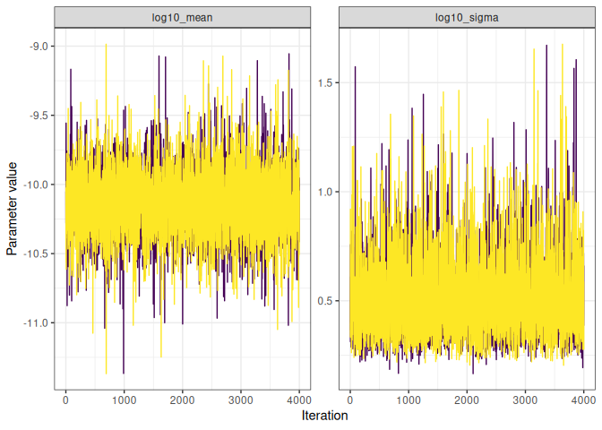
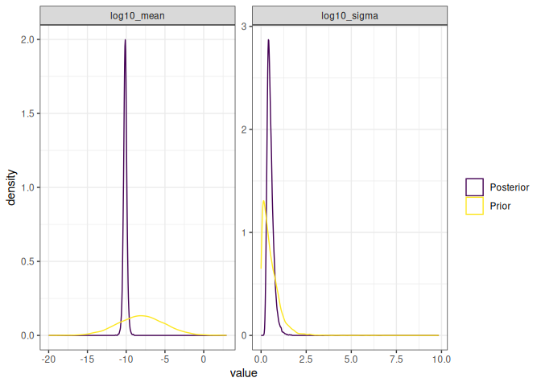

<!-- README.md is generated from README.Rmd. Please edit that file -->

# Mutation Accumulation Experiments

This is a package to analyse data generated from Mutation Accumulation
Experiments.

## How to use this package

### Installation

Clone the repository on your computer using

    git clone git@forgemia.inra.fr:konkam/MutAccExperiments.git

or

    git clone https://forgemia.inra.fr/konkam/MutAccExperiments.git

You should then install the present package on your computer, using a
command such a the following, from inside the package folder:

    Rscript -e "devtools::install_local('.')"

Alternatively, you may open the folder using the Rstudio editor and
press `Ctrl + Alt + B`.

- Dependencies should be:
  - R package devtools
  - JAGS + the R package RJags (On ubuntu, jags is on the canonical
    repository, available by apt install jags)
  - R package tidyverse
  - R package coda
  - A functioning latex installation
  - cmake

### Data format

``` r
library(MutAccExperiments)
library(tidyverse)
#> ── Attaching core tidyverse packages ──────────────────────── tidyverse 2.0.0 ──
#> ✔ dplyr     1.1.4     ✔ readr     2.1.5
#> ✔ forcats   1.0.0     ✔ stringr   1.5.1
#> ✔ ggplot2   3.5.1     ✔ tibble    3.2.1
#> ✔ lubridate 1.9.4     ✔ tidyr     1.3.1
#> ✔ purrr     1.0.2     
#> ── Conflicts ────────────────────────────────────────── tidyverse_conflicts() ──
#> ✖ dplyr::filter() masks stats::filter()
#> ✖ dplyr::lag()    masks stats::lag()
#> ℹ Use the conflicted package (<http://conflicted.r-lib.org/>) to force all conflicts to become errors
```

``` r
input_data = read.delim(file = "data-raw/SAT_mcmc_chain_labmut_R3610MMR-3610_inputfile.csv", sep = " ")
input_data
#>    genotype labmut nposinref  ngeninMA bps.n    strain context context_id m_sc
#> 1     R3610   C->T   1661176 251000.00   118    WT3610    C->T          1  118
#> 2     R3610   C->A   1661176 251000.00    23    WT3610    C->A          2   23
#> 3     R3610   C->G   1661176 251000.00     8    WT3610    C->G          3    8
#> 4     R3610   T->C   2133850 251000.00   120    WT3610    T->C          4  120
#> 5     R3610   T->A   2133850 251000.00    25    WT3610    T->A          5   25
#> 6     R3610   T->G   2133850 251000.00    25    WT3610    T->G          6   25
#> 7  MMR-3610   C->T   1661176  38000.00  2419      MMR-    C->T          1 2419
#> 8  MMR-3610   C->A   1661176  38000.00    14      MMR-    C->A          2   14
#> 9  MMR-3610   C->G   1661176  38000.00    21      MMR-    C->G          3   21
#> 10 MMR-3610   T->C   2133850  38000.00  2292      MMR-    T->C          4 2292
#> 11 MMR-3610   T->A   2133850  38000.00    58      MMR-    T->A          5   58
#> 12 MMR-3610   T->G   2133850  38000.00    40      MMR-    T->G          6   40
#> 13       C*   C->T   1661176   1895.14   210      polC    C->T          1  210
#> 14       C*   C->A   1661176   1895.14    19      polC    C->A          2   19
#> 15       C*   C->G   1661176   1895.14     2      polC    C->G          3    2
#> 16       C*   T->C   2133850   1895.14   138      polC    T->C          4  138
#> 17       C*   T->A   2133850   1895.14    13      polC    T->A          5   13
#> 18       C*   T->G   2133850   1895.14    13      polC    T->G          6   13
#> 19      LC*   C->T   1661176    230.49   274 polC_mutL    C->T          1  274
#> 20      LC*   C->A   1661176    230.49     2 polC_mutL    C->A          2    2
#> 21      LC*   C->G   1661176    230.49     2 polC_mutL    C->G          3    2
#> 22      LC*   T->C   2133850    230.49   210 polC_mutL    T->C          4  210
#> 23      LC*   T->A   2133850    230.49    12 polC_mutL    T->A          5   12
#> 24      LC*   T->G   2133850    230.49     2 polC_mutL    T->G          6    2
#>        n_c       t_s
#> 1  1661176 251000.00
#> 2  1661176 251000.00
#> 3  1661176 251000.00
#> 4  2133850 251000.00
#> 5  2133850 251000.00
#> 6  2133850 251000.00
#> 7  1661176  38000.00
#> 8  1661176  38000.00
#> 9  1661176  38000.00
#> 10 2133850  38000.00
#> 11 2133850  38000.00
#> 12 2133850  38000.00
#> 13 1661176   1895.14
#> 14 1661176   1895.14
#> 15 1661176   1895.14
#> 16 2133850   1895.14
#> 17 2133850   1895.14
#> 18 2133850   1895.14
#> 19 1661176    230.49
#> 20 1661176    230.49
#> 21 1661176    230.49
#> 22 2133850    230.49
#> 23 2133850    230.49
#> 24 2133850    230.49
```

The minimum data required to run the analysis is a data frame with the
following columns:

``` r
minimal_input_data = input_data %>% 
  filter(strain == first(strain)) %>% 
  rename(mutation_type = context_id,
         m = m_sc, 
         n = n_c,
         t = t_s) %>% 
  select(mutation_type, m, n, t) 
minimal_input_data
#>   mutation_type   m       n      t
#> 1             1 118 1661176 251000
#> 2             2  23 1661176 251000
#> 3             3   8 1661176 251000
#> 4             4 120 2133850 251000
#> 5             5  25 2133850 251000
#> 6             6  25 2133850 251000
```

### Fitting the GCM model

``` r
fit_GCM_model = minimal_input_data %>% 
  EstimateMusGCM_onestrain()
#> Compiling model graph
#>    Resolving undeclared variables
#>    Allocating nodes
#> Graph information:
#>    Observed stochastic nodes: 6
#>    Unobserved stochastic nodes: 17
#>    Total graph size: 61
#> 
#> Initializing model
#> Warning: No initial value blocks found and n.chains not specified: 2 chains
#> were used
#> Warning: No initial values were provided - JAGS will use the same initial
#> values for all chains
#> 
#> Auto-run JAGS
#> 
#> Running a pilot chain...
#> Compiling rjags model...
#> Calling the simulation using the rjags method...
#> Adapting the model for 1000 iterations...
#> Burning in the model for 4000 iterations...
#> Running the model for 10000 iterations...
#> Simulation complete
#> Finished running the simulation
#> 
#> Calculating the Gelman-Rubin statistic for 17 variables....
#> The Gelman-Rubin statistic is below 1.05 for all parameters
#> 
#> Calculating the necessary sample length based on the Raftery and
#> Lewis's diagnostic...
#> Indicated sample length achieved
#> Auto-run JAGS complete
```

### Accessing posterior samples

``` r
extract_posterior_samples(fit_GCM_model)
#> # A tibble: 8,000 × 19
#>    iteration `m_pred[1]` `m_pred[2]` `m_pred[3]` `m_pred[4]` `m_pred[5]`
#>        <int>       <dbl>       <dbl>       <dbl>       <dbl>       <dbl>
#>  1         1         150          26          11         106          23
#>  2         2         118          30           6          90          30
#>  3         3         121          31           8         163          18
#>  4         4         146          15          11         125          23
#>  5         5         129          24           5         131          17
#>  6         6         110          18          16         146          24
#>  7         7         120          26           6         131          33
#>  8         8         108          18           5         104          30
#>  9         9         122          26          14         139          27
#> 10        10         131          16          16         112          28
#> # ℹ 7,990 more rows
#> # ℹ 13 more variables: `m_pred[6]` <dbl>, `log10_mu[1]` <dbl>,
#> #   `log10_mu[2]` <dbl>, `log10_mu[3]` <dbl>, `log10_mu[4]` <dbl>,
#> #   `log10_mu[5]` <dbl>, `log10_mu[6]` <dbl>, log10_mean <dbl>,
#> #   log10_sigma <dbl>, log10_mean_prior <dbl>, log10_sigma_prior <dbl>,
#> #   log10_mu_prior <dbl>, chain_id <int>
```

Note that the m_pred variables are samples from the posterior predictive
distribution evaluated at the observed data points.

The variables with a suffix “\_prior” are samples from the prior
distribution.

### Various MCMC and model checks

``` r
fit_GCM_model %>% 
  traceplot
```



``` r
fit_GCM_model %>% 
  summary
#>                         Lower95      Median     Upper95        Mean          SD
#> m_pred[1]          8.600000e+01 116.0000000 146.0000000 116.7572500 15.36473501
#> m_pred[2]          9.000000e+00  23.0000000  35.0000000  23.1560000  6.75006366
#> m_pred[3]          1.000000e+00   9.0000000  17.0000000   9.1428750  4.28876566
#> m_pred[4]          8.700000e+01 118.0000000 147.0000000 119.0660000 15.40108903
#> m_pred[5]          1.200000e+01  25.0000000  39.0000000  25.4807500  7.06037255
#> m_pred[6]          1.100000e+01  25.0000000  38.0000000  25.2380000  7.03091639
#> log10_mu[1]       -9.637059e+00  -9.5540449  -9.4754191  -9.5547125  0.04101757
#> log10_mu[2]       -1.043407e+01 -10.2609615 -10.0809314 -10.2635035  0.09012299
#> log10_mu[3]       -1.096083e+01 -10.6768404 -10.3943078 -10.6822471  0.14639541
#> log10_mu[4]       -9.737535e+00  -9.6537415  -9.5814779  -9.6548870  0.03955195
#> log10_mu[5]       -1.049624e+01 -10.3289843 -10.1652523 -10.3315712  0.08496576
#> log10_mu[6]       -1.050298e+01 -10.3300795 -10.1674625 -10.3331733  0.08564421
#> log10_mean        -1.057015e+01 -10.1281817  -9.6771273 -10.1288218  0.22339251
#> log10_sigma        2.326865e-01   0.4777130   0.8637184   0.5149467  0.17927002
#> log10_mean_prior  -1.405069e+01  -8.0746604  -2.2226062  -8.0677566  3.01978789
#> log10_sigma_prior  1.040336e-04   0.4121137   1.4452745   0.5404168  0.50925354
#> log10_mu_prior    -1.416886e+01  -8.0416046  -2.2611406  -8.0630864  3.06679322
#>                   Mode        MCerr MC%ofSD SSeff         AC.20      psrf
#> m_pred[1]          115 0.1793747452     1.2  7337 -0.0038610660 0.9999476
#> m_pred[2]           23 0.0754680060     1.1  8000 -0.0087140159 0.9998903
#> m_pred[3]            8 0.0526182411     1.2  6643 -0.0154517465 1.0000563
#> m_pred[4]          116 0.1763232518     1.1  7629 -0.0061166461 1.0001717
#> m_pred[5]           24 0.0802886718     1.1  7733  0.0134570074 0.9998909
#> m_pred[6]           25 0.0805472374     1.1  7619 -0.0041846378 1.0004753
#> log10_mu[1]         NA 0.0004889701     1.2  7037  0.0135159399 1.0009578
#> log10_mu[2]         NA 0.0010332816     1.1  7607 -0.0008752111 1.0000588
#> log10_mu[3]         NA 0.0017866387     1.2  6714 -0.0058365167 1.0002421
#> log10_mu[4]         NA 0.0004673841     1.2  7161 -0.0024888264 1.0002499
#> log10_mu[5]         NA 0.0010281604     1.2  6829  0.0003000988 0.9999502
#> log10_mu[6]         NA 0.0010381505     1.2  6806 -0.0087371584 1.0005175
#> log10_mean          NA 0.0027155346     1.2  6767  0.0119105792 0.9999052
#> log10_sigma         NA 0.0028450647     1.6  3970  0.0150421988 1.0012102
#> log10_mean_prior    NA 0.0337622550     1.1  8000 -0.0056202158 0.9999095
#> log10_sigma_prior   NA 0.0056936277     1.1  8000 -0.0100348606 0.9998980
#> log10_mu_prior      NA 0.0342877906     1.1  8000 -0.0057731964 0.9999661
```

``` r
fit_GCM_model %>% 
  plot_prior_posterior
```



``` r
posterior_predictive_one_strain(minimal_input_data, fit_GCM_model)
#> Joining with `by = join_by(mutation_type)`
#>   mutation_type   m       n      t m_pred_mean m_pred_median m_pred_infCI
#> 1             1 118 1661176 251000   116.74575           116           88
#> 2             2  23 1661176 251000    23.14300            23           12
#> 3             3   8 1661176 251000     9.22100             9            2
#> 4             4 120 2133850 251000   119.12212           119           90
#> 5             5  25 2133850 251000    25.49363            25           13
#> 6             6  25 2133850 251000    25.42175            25           13
#>   m_pred_supCI m_pred_infquart m_pred_supquart
#> 1          149             106             127
#> 2           38              18              27
#> 3           19               6              12
#> 4          151             109             129
#> 5           41              20              30
#> 6           40              20              30
```
