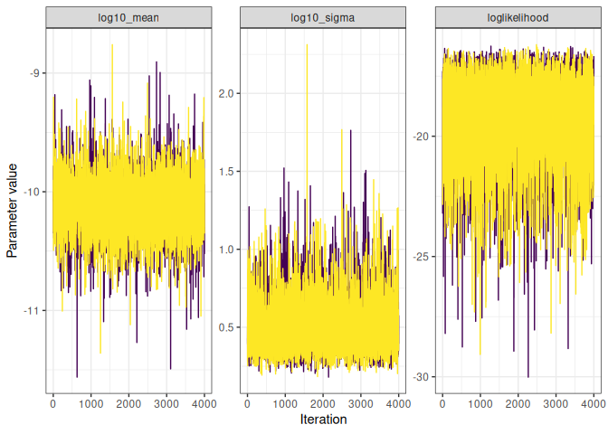
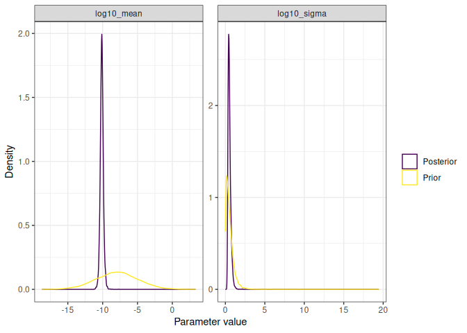
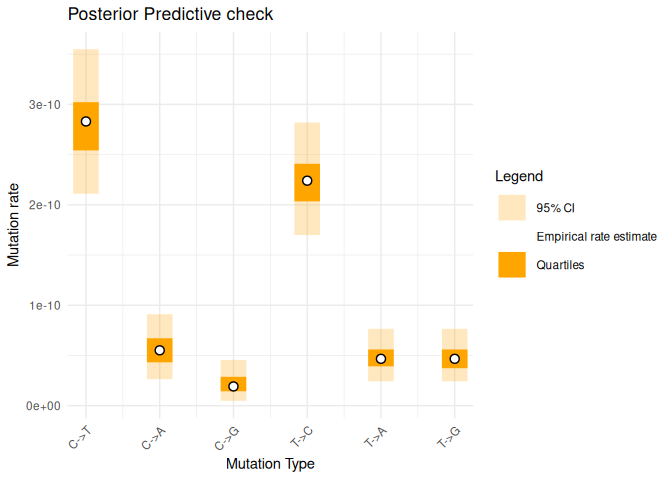
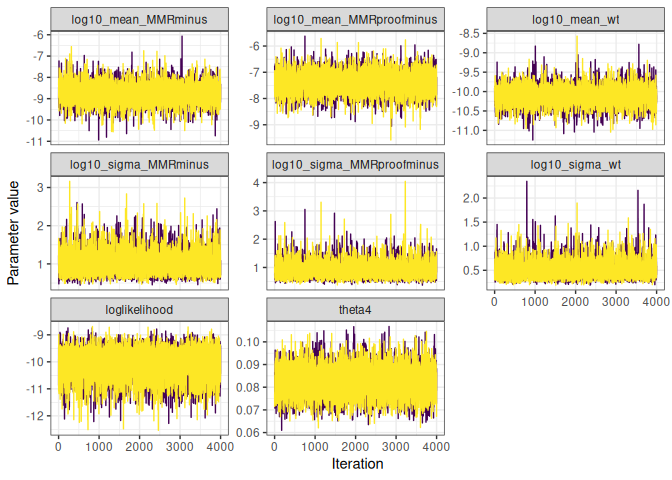
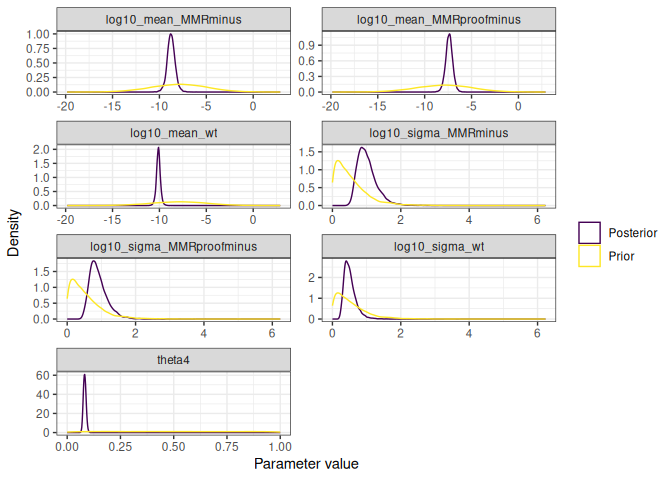
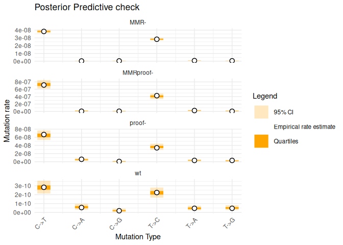

Mutation Accumulation Experiments
================

- [Installation](#installation)
- [Data format](#data-format)
- [Fitting the GCM model](#fitting-the-gcm-model)
  - [Accessing posterior samples](#accessing-posterior-samples)
  - [Various MCMC and model checks](#various-mcmc-and-model-checks)
- [Fitting the model with MMR
  saturation](#fitting-the-model-with-mmr-saturation)
  - [Accessing posterior samples](#accessing-posterior-samples-1)
  - [Various MCMC and model checks](#various-mcmc-and-model-checks-1)

<!-- README.md is generated from README.Rmd. Please edit that file -->

This is a package to analyse data generated from Mutation Accumulation
Experiments.

# Installation

Clone the repository on your computer using

    git clone git@forgemia.inra.fr:konkam/MutAccExperiments.git

or

    git clone https://forgemia.inra.fr/konkam/MutAccExperiments.git

You should then install the present package on your computer, using a
command such a the following, from inside the package folder:

    Rscript -e "devtools::install_local('.')"

Alternatively, you may open the folder using the Rstudio editor and
press `Ctrl + Alt + B`.

- Dependencies should be:
  - R package devtools
  - JAGS + the R package RJags (On ubuntu, jags is on the canonical
    repository, available by apt install jags)
  - R package tidyverse
  - R package coda

# Data format

``` r
library(MutAccExperiments)
library(tidyverse)
#> ── Attaching core tidyverse packages ──────────────────────── tidyverse 2.0.0 ──
#> ✔ dplyr     1.1.4     ✔ readr     2.1.5
#> ✔ forcats   1.0.0     ✔ stringr   1.5.1
#> ✔ ggplot2   3.5.1     ✔ tibble    3.2.1
#> ✔ lubridate 1.9.4     ✔ tidyr     1.3.1
#> ✔ purrr     1.0.2     
#> ── Conflicts ────────────────────────────────────────── tidyverse_conflicts() ──
#> ✖ dplyr::filter() masks stats::filter()
#> ✖ dplyr::lag()    masks stats::lag()
#> ℹ Use the conflicted package (<http://conflicted.r-lib.org/>) to force all conflicts to become errors
```

``` r
data(example_input_data)

input_data_onestrain <- example_input_data %>%
  filter(strain == first(strain))
```

The minimum data required to run the analysis is a data frame with the
following columns:

``` r
minimal_input_data_onestrain <- example_input_data %>%
  filter(strain == first(strain)) %>%
  select(mutation_id, m, n, t)
minimal_input_data_onestrain
#>   mutation_id   m       n      t
#> 1           1 118 1661176 251000
#> 2           2  23 1661176 251000
#> 3           3   8 1661176 251000
#> 4           4 120 2133850 251000
#> 5           5  25 2133850 251000
#> 6           6  25 2133850 251000
```

``` r
input_data_onestrain %>%
  check_input_format_GCM()
#> [1] "All good!"
```

# Fitting the GCM model

The GCM model is defined as follows:

$$
\begin{align}
m_i &\sim \text{Poisson}(n_i \mu_i t_i) \quad \forall i = 1, \ldots, I\\
\log_{10}(\mu_i) &\sim \mathcal{N}(\nu, \sigma) \\
\mu_0 &\sim \mathcal{N}(-8, 3) \\
\sigma &\sim \text{t}^+(0, 3, 5)\\
\end{align}
$$

where $m_i$ is the number of mutations observed of the $i$-th type,
$n_i$ is the number of possible mutation sites of type $i$ in the
genome, $t_i$ is the number of elapsed generations and $\mu_i$ is the
mutation rate for mutations of type $i$. $n_i, t_i$ are introduced so
that $\mu_i$ can be interpreted as a mutation rate per site and per
generation, which will be comparable over mutation types. $\nu$ is the
mean of the $\log10$ mutation rate, and $\sigma$ is the standard
deviation of the $\log10$ mutation rate. $\text{t}^+$ denotes the t
distribution truncated to positive values.

This is a hierarchical structure, where $\nu$ represents the average
tendency of the $\log10$ mutation rates (over mutation types), and
$\sigma$ represents the variability of the $\log10$ mutation rates
between mutation types. These two values caracterise the average
tendency and the dispersion of the mutation rates.

``` r
fit_GCM_model <- input_data_onestrain %>%
  EstimateMusGCM_onestrain()
#> Compiling model graph
#>    Resolving undeclared variables
#>    Allocating nodes
#> Graph information:
#>    Observed stochastic nodes: 6
#>    Unobserved stochastic nodes: 17
#>    Total graph size: 75
#> 
#> Initializing model
#> Warning: No initial value blocks found and n.chains not specified: 2 chains
#> were used
#> Warning: No initial values were provided - JAGS will use the same initial
#> values for all chains
#> 
#> Auto-run JAGS
#> 
#> Running a pilot chain...
#> Compiling rjags model...
#> Calling the simulation using the rjags method...
#> Adapting the model for 1000 iterations...
#> Burning in the model for 4000 iterations...
#> Running the model for 10000 iterations...
#> Simulation complete
#> Finished running the simulation
#> 
#> Calculating the Gelman-Rubin statistic for 18 variables....
#> The Gelman-Rubin statistic is below 1.05 for all parameters
#> 
#> Calculating the necessary sample length based on the Raftery and
#> Lewis's diagnostic...
#> Indicated sample length achieved
#> Auto-run JAGS complete
```

## Accessing posterior samples

``` r
extract_posterior_samples(fit_GCM_model, type = "mu")
#> # A tibble: 8,000 × 8
#>    `log10_mu[1]` `log10_mu[2]` `log10_mu[3]` `log10_mu[4]` `log10_mu[5]`
#>            <dbl>         <dbl>         <dbl>         <dbl>         <dbl>
#>  1         -9.65         -10.2         -10.7         -9.72         -10.5
#>  2         -9.52         -10.4         -10.8         -9.69         -10.2
#>  3         -9.51         -10.2         -10.6         -9.61         -10.3
#>  4         -9.52         -10.2         -10.6         -9.65         -10.3
#>  5         -9.55         -10.2         -10.8         -9.70         -10.3
#>  6         -9.56         -10.3         -10.6         -9.71         -10.2
#>  7         -9.55         -10.5         -10.9         -9.64         -10.2
#>  8         -9.52         -10.1         -10.8         -9.67         -10.4
#>  9         -9.53         -10.2         -11.1         -9.64         -10.3
#> 10         -9.54         -10.2         -10.7         -9.63         -10.3
#> # ℹ 7,990 more rows
#> # ℹ 3 more variables: `log10_mu[6]` <dbl>, iteration <int>, chain_id <int>
```

``` r
extract_posterior_samples(fit_GCM_model, type = "hyperparameters")
#> # A tibble: 8,000 × 5
#>    log10_sigma log10_mean loglikelihood iteration chain_id
#>          <dbl>      <dbl>         <dbl>     <int>    <int>
#>  1       0.538     -10.4          -22.9         1        1
#>  2       0.493      -9.92         -18.8         2        1
#>  3       0.416     -10.1          -17.9         3        1
#>  4       0.417      -9.89         -17.3         4        1
#>  5       0.389     -10.2          -17.1         5        1
#>  6       0.311     -10.1          -18.7         6        1
#>  7       0.487     -10.2          -20.1         7        1
#>  8       0.463     -10.3          -19.3         8        1
#>  9       0.466     -10.3          -18.6         9        1
#> 10       0.771     -10.1          -16.5        10        1
#> # ℹ 7,990 more rows
```

``` r
extract_posterior_samples(fit_GCM_model, type = "predictive")
#> # A tibble: 8,000 × 8
#>    `m_pred[1]` `m_pred[2]` `m_pred[3]` `m_pred[4]` `m_pred[5]` `m_pred[6]`
#>          <dbl>       <dbl>       <dbl>       <dbl>       <dbl>       <dbl>
#>  1         103          20           8         120          23          24
#>  2         131          15           2         109          41          22
#>  3         114          32           9         144          24          19
#>  4         109          17          12         150          25          32
#>  5         143          23           6         105          25          17
#>  6         108          20          14         106          35          21
#>  7         122          15           4         109          26          27
#>  8         149          36           8          88          19          26
#>  9         123          33           2         122          26          29
#> 10         127          25           6         134          29          27
#> # ℹ 7,990 more rows
#> # ℹ 2 more variables: iteration <int>, chain_id <int>
```

``` r
extract_posterior_samples(fit_GCM_model, type = "prior")
#> # A tibble: 8,000 × 5
#>    log10_mean_prior log10_sigma_prior log10_mu_prior iteration chain_id
#>               <dbl>             <dbl>          <dbl>     <int>    <int>
#>  1            -7.69            0.0891          -7.70         1        1
#>  2            -9.57            0.384          -10.2          2        1
#>  3            -3.96            1.88            -4.39         3        1
#>  4           -12.7             0.583          -13.2          4        1
#>  5            -2.04            0.325           -2.62         5        1
#>  6           -11.7             0.0197         -12.5          6        1
#>  7            -9.29            0.123           -9.37         7        1
#>  8            -5.18            0.0370          -5.21         8        1
#>  9            -9.39            0.695           -9.49         9        1
#> 10            -7.82            0.377           -9.24        10        1
#> # ℹ 7,990 more rows
```

Note that the m_pred variables are samples from the posterior predictive
distribution evaluated at the observed data points.

The variables with a suffix “\_prior” are samples from the prior
distribution.

You can also access the posterior samples at once:

``` r
extract_posterior_samples(fit_GCM_model)
#> # A tibble: 8,000 × 20
#>    iteration `m_pred[1]` `m_pred[2]` `m_pred[3]` `m_pred[4]` `m_pred[5]`
#>        <int>       <dbl>       <dbl>       <dbl>       <dbl>       <dbl>
#>  1         1         103          20           8         120          23
#>  2         2         131          15           2         109          41
#>  3         3         114          32           9         144          24
#>  4         4         109          17          12         150          25
#>  5         5         143          23           6         105          25
#>  6         6         108          20          14         106          35
#>  7         7         122          15           4         109          26
#>  8         8         149          36           8          88          19
#>  9         9         123          33           2         122          26
#> 10        10         127          25           6         134          29
#> # ℹ 7,990 more rows
#> # ℹ 14 more variables: `m_pred[6]` <dbl>, `log10_mu[1]` <dbl>,
#> #   `log10_mu[2]` <dbl>, `log10_mu[3]` <dbl>, `log10_mu[4]` <dbl>,
#> #   `log10_mu[5]` <dbl>, `log10_mu[6]` <dbl>, log10_mean <dbl>,
#> #   log10_sigma <dbl>, log10_mean_prior <dbl>, log10_sigma_prior <dbl>,
#> #   log10_mu_prior <dbl>, loglikelihood <dbl>, chain_id <int>
```

## Various MCMC and model checks

``` r
fit_GCM_model %>%
  traceplot()
```



``` r
fit_GCM_model %>%
  summary()
#>                         Lower95      Median     Upper95        Mean          SD
#> m_pred[1]          8.600000e+01 116.0000000 145.0000000 116.6671250 15.37809741
#> m_pred[2]          1.100000e+01  23.0000000  36.0000000  23.2538750  6.73489735
#> m_pred[3]          2.000000e+00   9.0000000  17.0000000   9.1166250  4.25802653
#> m_pred[4]          8.900000e+01 119.0000000 149.0000000 119.2595000 15.34908333
#> m_pred[5]          1.100000e+01  25.0000000  38.0000000  25.5127500  6.97658022
#> m_pred[6]          1.100000e+01  25.0000000  38.0000000  25.3968750  7.06132764
#> log10_mu[1]       -9.633683e+00  -9.5539137  -9.4767348  -9.5546157  0.04021141
#> log10_mu[2]       -1.043411e+01 -10.2597990 -10.0894610 -10.2621743  0.08899186
#> log10_mu[3]       -1.096328e+01 -10.6757758 -10.3955264 -10.6830577  0.14638516
#> log10_mu[4]       -9.730657e+00  -9.6549888  -9.5768129  -9.6552690  0.03981981
#> log10_mu[5]       -1.049555e+01 -10.3273609 -10.1663527 -10.3304435  0.08556554
#> log10_mu[6]       -1.049794e+01 -10.3295505 -10.1703235 -10.3316260  0.08374847
#> log10_mean        -1.058746e+01 -10.1225418  -9.7006230 -10.1220361  0.22164238
#> log10_sigma        2.423995e-01   0.4803851   0.8740023   0.5180696  0.18284591
#> log10_mean_prior  -1.377095e+01  -8.0371530  -2.0180134  -7.9900980  2.99798145
#> log10_sigma_prior  1.813607e-04   0.4179511   1.4727124   0.5507405  0.51993326
#> log10_mu_prior    -1.364836e+01  -8.0274935  -1.6226419  -7.9972939  3.04785972
#> loglikelihood     -2.241473e+01 -18.7740360 -16.4783198 -19.0983760  1.71235075
#>                   Mode        MCerr MC%ofSD SSeff        AC.20      psrf
#> m_pred[1]          119 0.1814944688     1.2  7179 -0.018352560 1.0002670
#> m_pred[2]           22 0.0771605100     1.1  7619 -0.005760335 1.0001908
#> m_pred[3]            8 0.0502956139     1.2  7167 -0.011472818 1.0003434
#> m_pred[4]          115 0.1749808023     1.1  7695  0.006595866 1.0001540
#> m_pred[5]           25 0.0819386951     1.2  7249  0.001542963 0.9999361
#> m_pred[6]           24 0.0822221645     1.2  7376 -0.005959765 1.0000289
#> log10_mu[1]         NA 0.0004954797     1.2  6586 -0.003392279 1.0006153
#> log10_mu[2]         NA 0.0010632614     1.2  7005 -0.012018393 1.0004344
#> log10_mu[3]         NA 0.0018699114     1.3  6128  0.010047432 1.0002375
#> log10_mu[4]         NA 0.0004707949     1.2  7154 -0.003298934 1.0000404
#> log10_mu[5]         NA 0.0010301198     1.2  6900  0.004321822 0.9999529
#> log10_mu[6]         NA 0.0010233977     1.2  6697 -0.017054944 0.9999147
#> log10_mean          NA 0.0024481204     1.1  8197  0.005569118 0.9999114
#> log10_sigma         NA 0.0031180307     1.7  3439  0.004940048 1.0023564
#> log10_mean_prior    NA 0.0335184516     1.1  8000  0.004393681 1.0002440
#> log10_sigma_prior   NA 0.0058130306     1.1  8000  0.008669397 0.9998810
#> log10_mu_prior      NA 0.0340761076     1.1  8000  0.003196234 1.0002881
#> loglikelihood       NA 0.0226523076     1.3  5714 -0.015409534 0.9998759
```

``` r
fit_GCM_model %>%
  plot_prior_posterior()
```



``` r
posterior_predictive_one_strain(fit_GCM_model)
#> Joining with `by = join_by(mutation_id)`
#> # A tibble: 6 × 17
#>   mutation_id m_pred_mean m_pred_median m_pred_infCI m_pred_supCI
#>         <int>       <dbl>         <dbl>        <dbl>        <dbl>
#> 1           1      117.             116           88          148
#> 2           2       23.3             23           11           38
#> 3           3        9.12             9            2           19
#> 4           4      119.             119           91          151
#> 5           5       25.5             25           13           41
#> 6           6       25.4             25           13           41
#> # ℹ 12 more variables: m_pred_infquart <dbl>, m_pred_supquart <dbl>,
#> #   genotype <chr>, mutation_label <chr>, nposinref <int>, ngeninMA <dbl>,
#> #   bps.n <int>, strain <chr>, context <chr>, m <int>, n <int>, t <dbl>
```

``` r
plot_posterior_predictive_onestrain(fit_GCM_model)
#> Joining with `by = join_by(mutation_id)`
#> Warning in geom_segment(aes(y = m_pred_infCI/(n * t), yend = m_pred_supCI/(n *
#> : Ignoring unknown parameters: `width`
#> Warning in geom_segment(aes(y = m_pred_infquart/(n * t), yend =
#> m_pred_supquart/(n * : Ignoring unknown parameters: `width`
```



# Fitting the model with MMR saturation

Compared to the previous unconstrained model, the MMR saturation model
assumes that the mutation rates of the different strains are related,
i.e. constrained by each other. Four strains are considered, wild-type
(wt), MMR-deactivated (MMR-), proofreading-deficient (proof-) and
MMR-deactivated and proofreading-deficient (MMR-\_proof-). The model
includes an explicit parameter for the saturation mechanism, which would
be equal to 0 in the absence of saturation. Therefore, this parameter
quantifies both the evidence for the existence of a saturation mechanism
and its magnitude.

n practice, for each mutation type we assume that there is a baseline
error rate $\gamma_i$. These mutations may be corrected by the
Proofreading mechanism with a probability $1-q_{\text{proofreading},i}$,
and further corrected by the MMR mechanism with a probability
$1-q_{\text{MMR},i}$. Therefore, in the wild-type strain, the number of
observed mutation is impacted by the error rate and the two repair
mechanisms. This error rate is observed directly for the mutant
MMR-\_proof- for which both MMR and Proofreading are inactivated. The
strain MMR- has the baseline error rate moderated by the Proofreading
mechanism, the strain C\* has the baseline error moderated by the MMR
mechanism which can saturate. Saturation is modelled as follows: a
proportion $1-\theta$ of mutations are corrected by the MMR mechanism
with probability $1-q_{\text{MMR},i}$, until saturation may occur. At
this point, the remaining proportion of mutations remain uncorrected. As
mentioned above, if $\theta=0$, there is no saturation, and an estimate
of $\theta$ significatively different from 0 provides evidence for
saturation. This results in the following system of equations for the
rate of mutation of type $i$ per site per generation in the four
strains:

$$
\begin{align}
\mu_{\text{MMR-\_proof-},i} &= \gamma_i \\
\mu_{\text{MMR-},i} &= \gamma_i q_{\text{proofreading},i} \\
\mu_{\text{proof-},i} &= \gamma_i \left(\theta + (1-\theta) q_{\text{MMR},i} \right) \\
\mu_{\text{wt},i} &= \gamma_i q_{\text{proofreading},i}q_{\text{MMR},i} \\
\end{align}
$$

We choose the following generative model:

$$
\begin{align}
m_{s, i} &\sim \text{Poisson}(n_{s, i} \mu_{s, i} t_{s, i}) \quad \text{for } i = 1, \ldots, I, s \in \left\{\text{wt}, \text{MMR-}, \text{proof-}, \text{MMR-proof-}\right\}\\
\log10 \mu_{s, i} &\sim \mathcal{N}(\nu_{s}, \sigma_{s})  \quad \text{for } i = 1, \ldots, I, s \in \left\{\text{wt}, \text{MMR-}, \text{MMR-proof-}\right\} \\
\nu_s &\sim \mathcal{N}(-8, 3) \quad \text{for } s \in \left\{\text{wt}, \text{MMR-}, \text{MMR-proof-}\right\}\\
\sigma_s &\sim \text{t}^+(0, 3, 5) \quad \text{for } s \in \left\{\text{wt}, \text{MMR-}, \text{MMR-proof-}\right\}\\
\theta &\sim \text{Beta}(1, 1)\\
\end{align}
$$

``` r
minimal_input_data <- example_input_data %>%
  select(strain, mutation_id, m, n, t)

minimal_input_data
#>           strain mutation_id    m       n         t
#> 1             wt           1  118 1661176 251000.00
#> 2             wt           2   23 1661176 251000.00
#> 3             wt           3    8 1661176 251000.00
#> 4             wt           4  120 2133850 251000.00
#> 5             wt           5   25 2133850 251000.00
#> 6             wt           6   25 2133850 251000.00
#> 7       MMRminus           1 2419 1661176  38000.00
#> 8       MMRminus           2   14 1661176  38000.00
#> 9       MMRminus           3   21 1661176  38000.00
#> 10      MMRminus           4 2292 2133850  38000.00
#> 11      MMRminus           5   58 2133850  38000.00
#> 12      MMRminus           6   40 2133850  38000.00
#> 13    proofminus           1  210 1661176   1895.14
#> 14    proofminus           2   19 1661176   1895.14
#> 15    proofminus           3    2 1661176   1895.14
#> 16    proofminus           4  138 2133850   1895.14
#> 17    proofminus           5   13 2133850   1895.14
#> 18    proofminus           6   13 2133850   1895.14
#> 19 MMRproofminus           1  274 1661176    230.49
#> 20 MMRproofminus           2    2 1661176    230.49
#> 21 MMRproofminus           3    2 1661176    230.49
#> 22 MMRproofminus           4  210 2133850    230.49
#> 23 MMRproofminus           5   12 2133850    230.49
#> 24 MMRproofminus           6    2 2133850    230.49
```

``` r
fit_MMRsaturation_model <- EstimateMusMMRsaturation(example_input_data)
#> Compiling model graph
#>    Resolving undeclared variables
#>    Allocating nodes
#> Graph information:
#>    Observed stochastic nodes: 24
#>    Unobserved stochastic nodes: 53
#>    Total graph size: 232
#> 
#> Initializing model
#> Warning: No initial value blocks found and n.chains not specified: 2 chains
#> were used
#> Warning: No initial values were provided - JAGS will use the same initial
#> values for all chains
#> 
#> Auto-run JAGS
#> 
#> Running a pilot chain...
#> Compiling rjags model...
#> Calling the simulation using the rjags method...
#> Adapting the model for 1000 iterations...
#> Burning in the model for 4000 iterations...
#> Running the model for 10000 iterations...
#> Simulation complete
#> Finished running the simulation
#> 
#> Calculating the Gelman-Rubin statistic for 60 variables....
#> The Gelman-Rubin statistic is below 1.05 for all parameters
#> 
#> Calculating the necessary sample length based on the Raftery and
#> Lewis's diagnostic...
#> The model will need to be run for a further 2319 updates.  This will
#> take approximately 0.1 seconds.
#> 
#> Calling the simulation using the rjags method...
#> Note: the model did not require adaptation
#> Running the model for 2319 iterations...
#> Simulation complete
#> Finished running the simulation
#> Indicated sample length achieved
#> Note: Summary statistics were not produced as there are >50 monitored
#> variables
#> [To override this behaviour see ?add.summary and ?runjags.options]
#> FALSEAuto-run JAGS complete
```

## Accessing posterior samples

``` r
extract_posterior_samples(fit_MMRsaturation_model, type = "mu")
#> # A tibble: 8,000 × 26
#>    `mu_wt[1]` `mu_wt[2]` `mu_wt[3]` `mu_wt[4]` `mu_wt[5]` `mu_wt[6]`
#>         <dbl>      <dbl>      <dbl>      <dbl>      <dbl>      <dbl>
#>  1   3.35e-10   5.64e-11   2.27e-11   2.09e-10   3.55e-11   4.33e-11
#>  2   3.30e-10   6.81e-11   1.72e-11   2.05e-10   6.38e-11   6.69e-11
#>  3   2.73e-10   6.67e-11   2.15e-11   2.45e-10   5.08e-11   4.54e-11
#>  4   2.50e-10   5.32e-11   2.43e-11   1.99e-10   4.26e-11   4.10e-11
#>  5   2.78e-10   7.80e-11   1.91e-11   2.22e-10   3.50e-11   4.15e-11
#>  6   2.67e-10   6.96e-11   1.41e-11   2.19e-10   6.62e-11   6.29e-11
#>  7   2.88e-10   6.11e-11   8.91e-12   2.29e-10   4.31e-11   5.27e-11
#>  8   3.11e-10   4.13e-11   1.72e-11   2.16e-10   5.82e-11   6.34e-11
#>  9   2.31e-10   7.22e-11   2.22e-11   2.28e-10   4.64e-11   6.24e-11
#> 10   3.24e-10   5.22e-11   2.17e-11   2.00e-10   4.45e-11   6.37e-11
#> # ℹ 7,990 more rows
#> # ℹ 20 more variables: `mu_proofminus[1]` <dbl>, `mu_proofminus[2]` <dbl>,
#> #   `mu_proofminus[3]` <dbl>, `mu_proofminus[4]` <dbl>,
#> #   `mu_proofminus[5]` <dbl>, `mu_proofminus[6]` <dbl>, `mu_MMRminus[1]` <dbl>,
#> #   `mu_MMRminus[2]` <dbl>, `mu_MMRminus[3]` <dbl>, `mu_MMRminus[4]` <dbl>,
#> #   `mu_MMRminus[5]` <dbl>, `mu_MMRminus[6]` <dbl>,
#> #   `mu_MMRproofminus[1]` <dbl>, `mu_MMRproofminus[2]` <dbl>, …
```

``` r
extract_posterior_samples(fit_MMRsaturation_model, type = "hyperparameters")
#> # A tibble: 8,000 × 10
#>    log10_sigma_wt log10_sigma_MMRminus log10_sigma_MMRproofminus log10_mean_wt
#>             <dbl>                <dbl>                     <dbl>         <dbl>
#>  1          0.478                0.879                     0.986         -9.97
#>  2          0.772                0.860                     1.02          -9.79
#>  3          0.316                0.761                     0.658        -10.1 
#>  4          0.389                0.869                     1.04          -9.82
#>  5          0.459                0.806                     0.938         -9.99
#>  6          0.506                1.03                      1.51          -9.90
#>  7          0.453                0.875                     1.13         -10.0 
#>  8          0.476                0.643                     0.935        -10.3 
#>  9          0.509                1.24                      1.40          -9.95
#> 10          0.352                1.17                      0.903        -10.1 
#> # ℹ 7,990 more rows
#> # ℹ 6 more variables: log10_mean_MMRminus <dbl>,
#> #   log10_mean_MMRproofminus <dbl>, theta4 <dbl>, loglikelihood <dbl>,
#> #   iteration <int>, chain_id <int>
```

``` r
extract_posterior_samples(fit_MMRsaturation_model, type = "predictive")
#> # A tibble: 8,000 × 26
#>    `m_wt_pred[1]` `m_wt_pred[2]` `m_wt_pred[3]` `m_wt_pred[4]` `m_wt_pred[5]`
#>             <dbl>          <dbl>          <dbl>          <dbl>          <dbl>
#>  1            170             27             15            110             18
#>  2            138             26              5            121             30
#>  3            129             34              6            119             28
#>  4             83             28              7            112             21
#>  5            109             33             10            125             17
#>  6            105             34              3            107             43
#>  7            104             21              1            125             18
#>  8            135             20              1            102             37
#>  9             90             34              6            131             28
#> 10            137             24              9            106             26
#> # ℹ 7,990 more rows
#> # ℹ 21 more variables: `m_wt_pred[6]` <dbl>, `m_proofminus_pred[1]` <dbl>,
#> #   `m_proofminus_pred[2]` <dbl>, `m_proofminus_pred[3]` <dbl>,
#> #   `m_proofminus_pred[4]` <dbl>, `m_proofminus_pred[5]` <dbl>,
#> #   `m_proofminus_pred[6]` <dbl>, `m_MMRminus_pred[1]` <dbl>,
#> #   `m_MMRminus_pred[2]` <dbl>, `m_MMRminus_pred[3]` <dbl>,
#> #   `m_MMRminus_pred[4]` <dbl>, `m_MMRminus_pred[5]` <dbl>, …
```

Note that the m_pred variables are samples from the posterior predictive
distribution evaluated at the observed data points.

The variables with a suffix “\_prior” are samples from the prior
distribution.

You can also access the posterior samples at once:

``` r
extract_posterior_samples(fit_MMRsaturation_model)
#> # A tibble: 8,000 × 62
#>    iteration `mu_wt[1]` `mu_wt[2]` `mu_wt[3]` `mu_wt[4]` `mu_wt[5]` `mu_wt[6]`
#>        <int>      <dbl>      <dbl>      <dbl>      <dbl>      <dbl>      <dbl>
#>  1         1   3.35e-10   5.64e-11   2.27e-11   2.09e-10   3.55e-11   4.33e-11
#>  2         2   3.30e-10   6.81e-11   1.72e-11   2.05e-10   6.38e-11   6.69e-11
#>  3         3   2.73e-10   6.67e-11   2.15e-11   2.45e-10   5.08e-11   4.54e-11
#>  4         4   2.50e-10   5.32e-11   2.43e-11   1.99e-10   4.26e-11   4.10e-11
#>  5         5   2.78e-10   7.80e-11   1.91e-11   2.22e-10   3.50e-11   4.15e-11
#>  6         6   2.67e-10   6.96e-11   1.41e-11   2.19e-10   6.62e-11   6.29e-11
#>  7         7   2.88e-10   6.11e-11   8.91e-12   2.29e-10   4.31e-11   5.27e-11
#>  8         8   3.11e-10   4.13e-11   1.72e-11   2.16e-10   5.82e-11   6.34e-11
#>  9         9   2.31e-10   7.22e-11   2.22e-11   2.28e-10   4.64e-11   6.24e-11
#> 10        10   3.24e-10   5.22e-11   2.17e-11   2.00e-10   4.45e-11   6.37e-11
#> # ℹ 7,990 more rows
#> # ℹ 55 more variables: `mu_proofminus[1]` <dbl>, `mu_proofminus[2]` <dbl>,
#> #   `mu_proofminus[3]` <dbl>, `mu_proofminus[4]` <dbl>,
#> #   `mu_proofminus[5]` <dbl>, `mu_proofminus[6]` <dbl>, `mu_MMRminus[1]` <dbl>,
#> #   `mu_MMRminus[2]` <dbl>, `mu_MMRminus[3]` <dbl>, `mu_MMRminus[4]` <dbl>,
#> #   `mu_MMRminus[5]` <dbl>, `mu_MMRminus[6]` <dbl>,
#> #   `mu_MMRproofminus[1]` <dbl>, `mu_MMRproofminus[2]` <dbl>, …
```

## Various MCMC and model checks

``` r
fit_MMRsaturation_model %>%
  traceplot()
```



``` r
fit_MMRsaturation_model %>%
  summary()
#> Calculating summary statistics...
#> Calculating the Gelman-Rubin statistic for 60 variables....
#>                                 Lower95        Median       Upper95
#> mu_wt[1]                   2.314297e-10  2.805618e-10  3.310286e-10
#> mu_wt[2]                   3.868802e-11  6.037790e-11  8.410981e-11
#> mu_wt[3]                   8.623602e-12  2.071428e-11  3.498725e-11
#> mu_wt[4]                   1.811530e-10  2.197764e-10  2.589565e-10
#> mu_wt[5]                   3.053074e-11  4.620526e-11  6.511538e-11
#> mu_wt[6]                   3.265808e-11  5.081080e-11  6.989893e-11
#> mu_proofminus[1]           5.726419e-08  6.476230e-08  7.259845e-08
#> mu_proofminus[2]           3.007606e-09  4.990871e-09  7.346480e-09
#> mu_proofminus[3]           1.568802e-10  7.214525e-10  1.486762e-09
#> mu_proofminus[4]           3.164480e-08  3.638392e-08  4.108849e-08
#> mu_proofminus[5]           2.070284e-09  3.310720e-09  4.674407e-09
#> mu_proofminus[6]           1.149654e-09  2.214916e-09  3.400090e-09
#> mu_MMRminus[1]             3.678370e-08  3.828201e-08  3.978192e-08
#> mu_MMRminus[2]             1.008407e-10  1.887617e-10  2.979557e-10
#> mu_MMRminus[3]             2.113741e-10  3.364573e-10  4.946186e-10
#> mu_MMRminus[4]             2.714293e-08  2.826272e-08  2.948101e-08
#> mu_MMRminus[5]             5.423812e-10  7.173736e-10  9.021288e-10
#> mu_MMRminus[6]             3.269329e-10  4.670592e-10  6.221446e-10
#> mu_MMRproofminus[1]        6.528818e-07  7.279355e-07  8.057342e-07
#> mu_MMRproofminus[2]        6.396168e-09  1.322976e-08  2.091286e-08
#> mu_MMRproofminus[3]        1.228419e-09  5.128227e-09  1.083769e-08
#> mu_MMRproofminus[4]        3.581256e-07  4.073749e-07  4.557639e-07
#> mu_MMRproofminus[5]        1.463674e-08  2.326264e-08  3.322994e-08
#> mu_MMRproofminus[6]        6.718771e-09  1.210678e-08  1.941238e-08
#> log10_mean_wt             -1.055706e+01 -1.011311e+01 -9.663101e+00
#> log10_mean_MMRminus       -9.634543e+00 -8.752277e+00 -7.943958e+00
#> log10_mean_MMRproofminus  -8.173773e+00 -7.397613e+00 -6.626434e+00
#> log10_sigma_wt             2.312687e-01  4.827727e-01  8.716322e-01
#> log10_sigma_MMRminus       5.573659e-01  9.545633e-01  1.571585e+00
#> log10_sigma_MMRproofminus  5.080764e-01  8.676568e-01  1.476206e+00
#> theta4                     7.045049e-02  8.209128e-02  9.458893e-02
#> log10_mean_prior          -1.372791e+01 -8.010294e+00 -2.083868e+00
#> log10_sigma_prior          1.930791e-04  4.294518e-01  1.549325e+00
#> log10_mu_prior            -1.366346e+01 -8.022111e+00 -1.762012e+00
#> theta4_prior               6.926336e-04  4.998557e-01  9.475040e-01
#> m_wt_pred[1]               8.700000e+01  1.170000e+02  1.460000e+02
#> m_wt_pred[2]               1.100000e+01  2.500000e+01  3.800000e+01
#> m_wt_pred[3]               2.000000e+00  9.000000e+00  1.700000e+01
#> m_wt_pred[4]               8.900000e+01  1.180000e+02  1.480000e+02
#> m_wt_pred[5]               1.200000e+01  2.500000e+01  3.800000e+01
#> m_wt_pred[6]               1.400000e+01  2.700000e+01  4.200000e+01
#> m_proofminus_pred[1]       1.650000e+02  2.040000e+02  2.390000e+02
#> m_proofminus_pred[2]       6.000000e+00  1.600000e+01  2.600000e+01
#> m_proofminus_pred[3]       0.000000e+00  2.000000e+00  6.000000e+00
#> m_proofminus_pred[4]       1.170000e+02  1.470000e+02  1.770000e+02
#> m_proofminus_pred[5]       5.000000e+00  1.300000e+01  2.200000e+01
#> m_proofminus_pred[6]       3.000000e+00  9.000000e+00  1.700000e+01
#> m_MMRminus_pred[1]         2.279000e+03  2.417000e+03  2.550000e+03
#> m_MMRminus_pred[2]         3.000000e+00  1.200000e+01  2.100000e+01
#> m_MMRminus_pred[3]         9.000000e+00  2.100000e+01  3.400000e+01
#> m_MMRminus_pred[4]         2.160000e+03  2.292000e+03  2.420000e+03
#> m_MMRminus_pred[5]         3.700000e+01  5.800000e+01  7.800000e+01
#> m_MMRminus_pred[6]         2.200000e+01  3.800000e+01  5.500000e+01
#> m_MMRproofminus_pred[1]    2.350000e+02  2.790000e+02  3.220000e+02
#> m_MMRproofminus_pred[2]    0.000000e+00  5.000000e+00  1.000000e+01
#> m_MMRproofminus_pred[3]    0.000000e+00  2.000000e+00  6.000000e+00
#> m_MMRproofminus_pred[4]    1.620000e+02  2.000000e+02  2.340000e+02
#> m_MMRproofminus_pred[5]    4.000000e+00  1.100000e+01  1.900000e+01
#> m_MMRproofminus_pred[6]    0.000000e+00  6.000000e+00  1.100000e+01
#> loglikelihood             -1.107394e+01 -1.001997e+01 -9.105845e+00
#>                                    Mean           SD         Mode        MCerr
#> mu_wt[1]                   2.812079e-10 2.553317e-11 1.932734e-10          Inf
#> mu_wt[2]                   6.098719e-11 1.168691e-11 2.507042e-11          Inf
#> mu_wt[3]                   2.155841e-11 7.001190e-12 4.521538e-12          Inf
#> mu_wt[4]                   2.204595e-10 2.017680e-11 1.567683e-10          Inf
#> mu_wt[5]                   4.685973e-11 9.004520e-12 1.982729e-11          Inf
#> mu_wt[6]                   5.128286e-11 9.535414e-12 2.178907e-11          Inf
#> mu_proofminus[1]           6.477110e-08 3.918095e-09           NA          Inf
#> mu_proofminus[2]           5.089727e-09 1.131694e-09 1.917632e-09          Inf
#> mu_proofminus[3]           7.833240e-10 3.714844e-10 7.162842e-11          Inf
#> mu_proofminus[4]           3.639774e-08 2.434530e-09           NA          Inf
#> mu_proofminus[5]           3.359225e-09 6.785463e-10 1.359580e-09          Inf
#> mu_proofminus[6]           2.271452e-09 5.916562e-10 4.810342e-10          Inf
#> mu_MMRminus[1]             3.828854e-08 7.780081e-10           NA          Inf
#> mu_MMRminus[2]             1.937486e-10 5.180942e-11 5.855959e-11          Inf
#> mu_MMRminus[3]             3.414226e-10 7.376522e-11 1.375890e-10          Inf
#> mu_MMRminus[4]             2.826056e-08 5.922101e-10           NA          Inf
#> mu_MMRminus[5]             7.205525e-10 9.236684e-11 4.401801e-10          Inf
#> mu_MMRminus[6]             4.719652e-10 7.665671e-11 2.422875e-10          Inf
#> mu_MMRproofminus[1]        7.295406e-07 3.932485e-08           NA 5.158810e-10
#> mu_MMRproofminus[2]        1.362191e-08 3.850915e-09           NA          Inf
#> mu_MMRproofminus[3]        5.566421e-09 2.661479e-09           NA          Inf
#> mu_MMRproofminus[4]        4.080338e-07 2.494011e-08           NA 3.280352e-10
#> mu_MMRproofminus[5]        2.365436e-08 4.840962e-09           NA          Inf
#> mu_MMRproofminus[6]        1.243809e-08 3.309547e-09           NA          Inf
#> log10_mean_wt             -1.011519e+01 2.261596e-01           NA 2.573973e-03
#> log10_mean_MMRminus       -8.756890e+00 4.270339e-01           NA 4.774384e-03
#> log10_mean_MMRproofminus  -7.396673e+00 3.893111e-01           NA 4.352630e-03
#> log10_sigma_wt             5.175638e-01 1.823190e-01           NA 2.617646e-03
#> log10_sigma_MMRminus       1.005312e+00 2.842252e-01           NA 3.863154e-03
#> log10_sigma_MMRproofminus  9.197733e-01 2.741380e-01           NA 3.679682e-03
#> theta4                     8.222071e-02 6.246407e-03           NA 8.790726e-05
#> log10_mean_prior          -8.008748e+00 2.985532e+00           NA 3.337927e-02
#> log10_sigma_prior          5.658903e-01 5.292729e-01           NA 5.872508e-03
#> log10_mu_prior            -8.001378e+00 3.073480e+00           NA 3.436256e-02
#> theta4_prior               5.016158e-01 2.875006e-01           NA 3.135798e-03
#> m_wt_pred[1]               1.172897e+02 1.521060e+01 1.160000e+02 1.700597e-01
#> m_wt_pred[2]               2.533125e+01 6.990557e+00 2.400000e+01 8.245753e-02
#> m_wt_pred[3]               9.003250e+00 4.121967e+00 8.000000e+00 4.656420e-02
#> m_wt_pred[4]               1.180268e+02 1.525712e+01 1.200000e+02 1.705798e-01
#> m_wt_pred[5]               2.507812e+01 6.896645e+00 2.400000e+01 7.710684e-02
#> m_wt_pred[6]               2.753013e+01 7.313688e+00 2.700000e+01 8.176952e-02
#> m_proofminus_pred[1]       2.040710e+02 1.882276e+01 1.930000e+02 2.178007e-01
#> m_proofminus_pred[2]       1.602100e+01 5.417539e+00 1.600000e+01 6.056993e-02
#> m_proofminus_pred[3]       2.453875e+00 1.965033e+00 1.000000e+00 2.196974e-02
#> m_proofminus_pred[4]       1.471486e+02 1.548610e+01 1.400000e+02 1.767376e-01
#> m_proofminus_pred[5]       1.359500e+01 4.617617e+00 1.200000e+01 5.214812e-02
#> m_proofminus_pred[6]       9.179875e+00 3.856537e+00 8.000000e+00 4.427144e-02
#> m_MMRminus_pred[1]         2.417244e+03 6.909624e+01 2.420000e+03 7.803159e-01
#> m_MMRminus_pred[2]         1.217437e+01 4.787727e+00 1.000000e+01 5.929737e-02
#> m_MMRminus_pred[3]         2.156625e+01 6.618503e+00 1.800000e+01 7.335827e-02
#> m_MMRminus_pred[4]         2.291555e+03 6.755889e+01 2.273000e+03 7.553313e-01
#> m_MMRminus_pred[5]         5.841375e+01 1.067524e+01 5.700000e+01 1.193528e-01
#> m_MMRminus_pred[6]         3.827350e+01 8.764605e+00 3.600000e+01 1.010182e-01
#> m_MMRproofminus_pred[1]    2.791646e+02 2.213272e+01 2.810000e+02 2.711111e-01
#> m_MMRproofminus_pred[2]    5.212500e+00 2.711229e+00 4.000000e+00 3.306606e-02
#> m_MMRproofminus_pred[3]    2.148750e+00 1.793607e+00 1.000000e+00 2.005313e-02
#> m_MMRproofminus_pred[4]    2.007069e+02 1.862470e+01 2.000000e+02 2.195356e-01
#> m_MMRproofminus_pred[5]    1.153288e+01 4.078327e+00 1.000000e+01 4.675850e-02
#> m_MMRproofminus_pred[6]    6.105000e+00 2.920024e+00 6.000000e+00 3.170466e-02
#> loglikelihood             -1.007102e+01 5.177301e-01           NA 6.278890e-03
#>                           MC%ofSD SSeff         AC.30      psrf
#> mu_wt[1]                      Inf     0 -0.0149904602 0.9999866
#> mu_wt[2]                      Inf     0 -0.0002199182 1.0003171
#> mu_wt[3]                      Inf     0 -0.0107761501 1.0003431
#> mu_wt[4]                      Inf     0 -0.0144171478 1.0011665
#> mu_wt[5]                      Inf     0  0.0006949548 1.0002172
#> mu_wt[6]                      Inf     0 -0.0047035203 1.0005674
#> mu_proofminus[1]              Inf     0  0.0062060838 0.9999535
#> mu_proofminus[2]              Inf     0 -0.0077978256 1.0001262
#> mu_proofminus[3]              Inf     0  0.0050879399 1.0002246
#> mu_proofminus[4]              Inf     0  0.0197667038 1.0002986
#> mu_proofminus[5]              Inf     0  0.0139818503 1.0011404
#> mu_proofminus[6]              Inf     0 -0.0048036921 1.0002333
#> mu_MMRminus[1]                Inf     0 -0.0104537541 1.0002469
#> mu_MMRminus[2]                Inf     0  0.0072344378 1.0001869
#> mu_MMRminus[3]                Inf     0  0.0094592773 1.0007343
#> mu_MMRminus[4]                Inf     0 -0.0179524814 1.0002509
#> mu_MMRminus[5]                Inf     0 -0.0042358419 1.0002020
#> mu_MMRminus[6]                Inf     0 -0.0055528453 1.0004659
#> mu_MMRproofminus[1]           1.3  5811 -0.0070624058 1.0000675
#> mu_MMRproofminus[2]           Inf     0  0.0022372717 0.9999497
#> mu_MMRproofminus[3]           Inf     0  0.0078594809 1.0003712
#> mu_MMRproofminus[4]           1.3  5780 -0.0050459368 1.0005494
#> mu_MMRproofminus[5]           Inf     0  0.0159412702 1.0007715
#> mu_MMRproofminus[6]           Inf     0 -0.0026823185 1.0002908
#> log10_mean_wt                 1.1  7720  0.0122133741 1.0010885
#> log10_mean_MMRminus           1.1  8000 -0.0075602859 1.0004452
#> log10_mean_MMRproofminus      1.1  8000 -0.0111421782 1.0001333
#> log10_sigma_wt                1.4  4851 -0.0037546099 1.0006013
#> log10_sigma_MMRminus          1.4  5413  0.0216471465 1.0004110
#> log10_sigma_MMRproofminus     1.3  5550  0.0097655907 1.0014502
#> theta4                        1.4  5049  0.0054083797 1.0003117
#> log10_mean_prior              1.1  8000 -0.0045004657 0.9999217
#> log10_sigma_prior             1.1  8123 -0.0054142365 1.0006896
#> log10_mu_prior                1.1  8000 -0.0054930893 0.9999559
#> theta4_prior                  1.1  8406  0.0080545667 1.0011295
#> m_wt_pred[1]                  1.1  8000 -0.0252007988 1.0001188
#> m_wt_pred[2]                  1.2  7187  0.0120523247 1.0008011
#> m_wt_pred[3]                  1.1  7836 -0.0146468683 1.0001060
#> m_wt_pred[4]                  1.1  8000 -0.0043703959 1.0009350
#> m_wt_pred[5]                  1.1  8000  0.0064040498 1.0001210
#> m_wt_pred[6]                  1.1  8000  0.0020359584 1.0011959
#> m_proofminus_pred[1]          1.2  7469  0.0041543812 1.0000069
#> m_proofminus_pred[2]          1.1  8000 -0.0001132441 1.0000180
#> m_proofminus_pred[3]          1.1  8000 -0.0010393446 0.9999033
#> m_proofminus_pred[4]          1.1  7678 -0.0041067159 1.0000931
#> m_proofminus_pred[5]          1.1  7841  0.0037464738 1.0011593
#> m_proofminus_pred[6]          1.1  7588 -0.0048594724 1.0000063
#> m_MMRminus_pred[1]            1.1  7841  0.0022917611 0.9999567
#> m_MMRminus_pred[2]            1.2  6519 -0.0129384953 1.0003293
#> m_MMRminus_pred[3]            1.1  8140  0.0232401845 1.0007091
#> m_MMRminus_pred[4]            1.1  8000 -0.0126640817 1.0002439
#> m_MMRminus_pred[5]            1.1  8000 -0.0082675730 1.0003619
#> m_MMRminus_pred[6]            1.2  7528 -0.0041922024 1.0003394
#> m_MMRproofminus_pred[1]       1.2  6665 -0.0148171950 1.0009069
#> m_MMRproofminus_pred[2]       1.2  6723  0.0007000993 1.0007096
#> m_MMRproofminus_pred[3]       1.1  8000  0.0103405425 0.9999352
#> m_MMRproofminus_pred[4]       1.2  7197 -0.0035336646 0.9999953
#> m_MMRproofminus_pred[5]       1.1  7608 -0.0017926181 0.9999663
#> m_MMRproofminus_pred[6]       1.1  8483  0.0060272715 0.9999466
#> loglikelihood                 1.2  6799 -0.0159138550 1.0001712
```

``` r
fit_MMRsaturation_model %>%
  plot_prior_posterior()
```



``` r
fit_MMRsaturation_model %>%
  posterior_predictive()
#> Joining with `by = join_by(strain, mutation_id)`
#> # A tibble: 24 × 18
#>    m_pred_mean m_pred_median m_pred_infCI m_pred_supCI m_pred_infquart
#>          <dbl>         <dbl>        <dbl>        <dbl>           <dbl>
#>  1      117.             117           89         148              107
#>  2       25.3             25           13          40               20
#>  3        9.00             9            2          18                6
#>  4      118.             118           90         149.             107
#>  5       25.1             25           13          40               20
#>  6       27.5             27           14          43               22
#>  7      204.             204          168         243              191
#>  8       16.0             16            7          28               12
#>  9        2.45             2            0           7                1
#> 10      147.             147          117         178              137
#> # ℹ 14 more rows
#> # ℹ 13 more variables: m_pred_supquart <dbl>, colnam <chr>, strain <chr>,
#> #   mutation_id <dbl>, genotype <chr>, mutation_label <chr>, nposinref <int>,
#> #   ngeninMA <dbl>, bps.n <int>, context <chr>, m <int>, n <int>, t <dbl>
```

``` r
fit_MMRsaturation_model %>%
  plot_posterior_predictive()
#> Joining with `by = join_by(strain, mutation_id)`
```


