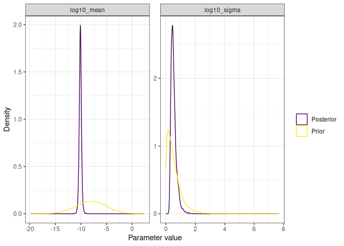
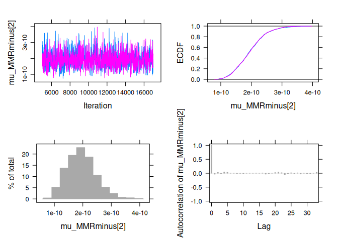
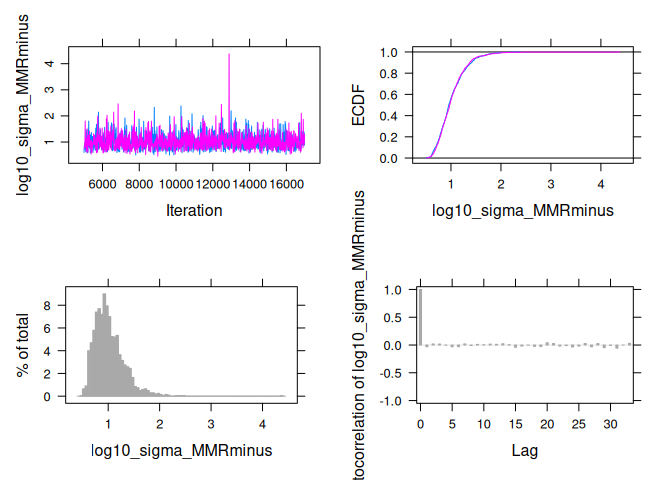
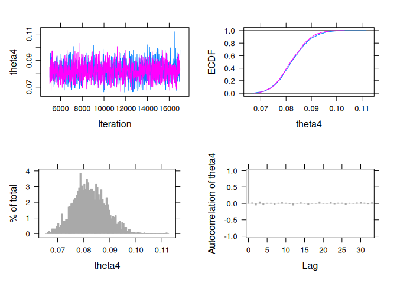
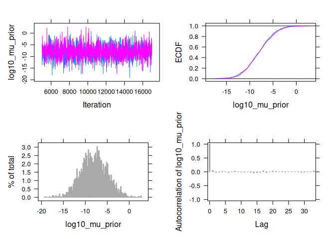
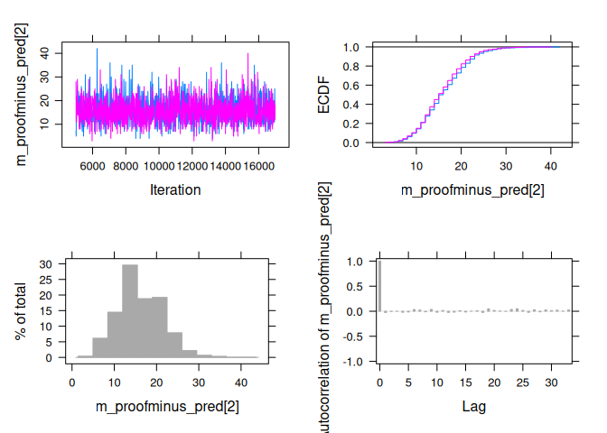
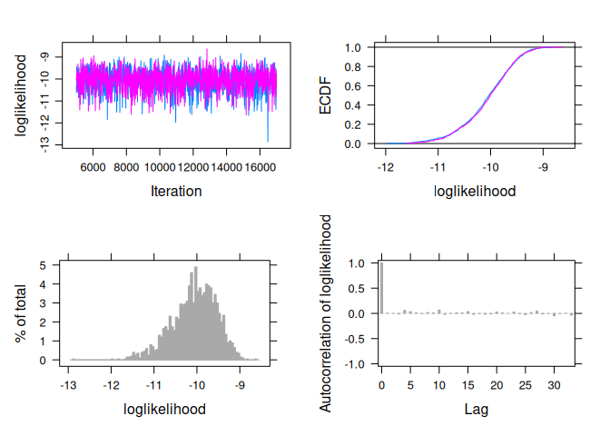
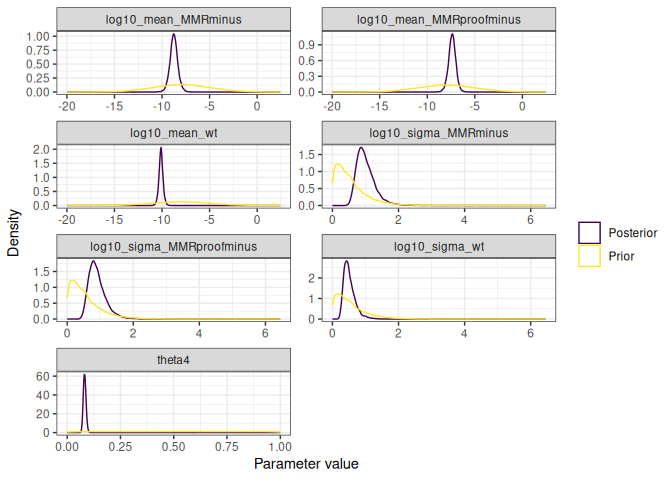

Mutation Accumulation Experiments
================

- [Installation](#installation)
- [Data format](#data-format)
- [Fitting the GCM model](#fitting-the-gcm-model)
  - [Accessing posterior samples](#accessing-posterior-samples)
  - [Various MCMC and model checks](#various-mcmc-and-model-checks)
- [Fitting the model with MMR
  saturation](#fitting-the-model-with-mmr-saturation)
  - [Accessing posterior samples](#accessing-posterior-samples-1)
  - [Various MCMC and model checks](#various-mcmc-and-model-checks-1)

<!-- README.md is generated from README.Rmd. Please edit that file -->

This is a package to analyse data generated from Mutation Accumulation
Experiments.

# Installation

Clone the repository on your computer using

    git clone git@forgemia.inra.fr:konkam/MutAccExperiments.git

or

    git clone https://forgemia.inra.fr/konkam/MutAccExperiments.git

You should then install the present package on your computer, using a
command such a the following, from inside the package folder:

    Rscript -e "devtools::install_local('.')"

Alternatively, you may open the folder using the Rstudio editor and
press `Ctrl + Alt + B`.

- Dependencies should be:
  - R package devtools
  - JAGS + the R package RJags (On ubuntu, jags is on the canonical
    repository, available by apt install jags)
  - R package tidyverse
  - R package coda
  - A functioning latex installation
  - cmake

# Data format

``` r
library(MutAccExperiments)
library(tidyverse)
#> ── Attaching core tidyverse packages ──────────────────────── tidyverse 2.0.0 ──
#> ✔ dplyr     1.1.4     ✔ readr     2.1.5
#> ✔ forcats   1.0.0     ✔ stringr   1.5.1
#> ✔ ggplot2   3.5.1     ✔ tibble    3.2.1
#> ✔ lubridate 1.9.4     ✔ tidyr     1.3.1
#> ✔ purrr     1.0.2     
#> ── Conflicts ────────────────────────────────────────── tidyverse_conflicts() ──
#> ✖ dplyr::filter() masks stats::filter()
#> ✖ dplyr::lag()    masks stats::lag()
#> ℹ Use the conflicted package (<http://conflicted.r-lib.org/>) to force all conflicts to become errors
```

``` r
input_data = read.delim(file = "data-raw/SAT_mcmc_chain_labmut_R3610MMR-3610_inputfile.csv", sep = " ") %>% 
  rename(mutation_id = context_id,
         m = m_sc, 
         n = n_c,
         t = t_s, 
         mutation_label = labmut) %>% 
  mutate(strain = gsub("MMR-", "MMRminus", strain))  %>%
  mutate(strain = gsub("WT3610", "wt", strain)) %>% 
  mutate(strain = gsub("polC_mutL", "MMRproofminus", strain)) %>% 
  mutate(strain = gsub("polC", "proofminus", strain))

input_data_onestrain = input_data %>% 
  filter(strain == first(strain)) 
```

The minimum data required to run the analysis is a data frame with the
following columns:

``` r
minimal_input_data_onestrain = input_data %>% 
  filter(strain == first(strain)) %>% 
  select(mutation_id, m, n, t) 
minimal_input_data_onestrain
#>   mutation_id   m       n      t
#> 1           1 118 1661176 251000
#> 2           2  23 1661176 251000
#> 3           3   8 1661176 251000
#> 4           4 120 2133850 251000
#> 5           5  25 2133850 251000
#> 6           6  25 2133850 251000
```

``` r
input_data_onestrain %>% 
  check_input_format_GCM()
#> [1] "All good!"
```

# Fitting the GCM model

``` r
fit_GCM_model = input_data_onestrain %>% 
  EstimateMusGCM_onestrain()
#> Compiling model graph
#>    Resolving undeclared variables
#>    Allocating nodes
#> Graph information:
#>    Observed stochastic nodes: 6
#>    Unobserved stochastic nodes: 17
#>    Total graph size: 75
#> 
#> Initializing model
#> Warning: No initial value blocks found and n.chains not specified: 2 chains
#> were used
#> Warning: No initial values were provided - JAGS will use the same initial
#> values for all chains
#> 
#> Auto-run JAGS
#> 
#> Running a pilot chain...
#> Compiling rjags model...
#> Calling the simulation using the rjags method...
#> Adapting the model for 1000 iterations...
#> Burning in the model for 4000 iterations...
#> Running the model for 10000 iterations...
#> Simulation complete
#> Finished running the simulation
#> 
#> Calculating the Gelman-Rubin statistic for 18 variables....
#> The Gelman-Rubin statistic is below 1.05 for all parameters
#> 
#> Calculating the necessary sample length based on the Raftery and
#> Lewis's diagnostic...
#> Indicated sample length achieved
#> Auto-run JAGS complete
```

## Accessing posterior samples

``` r
extract_posterior_samples(fit_GCM_model, type = "mu")
#> # A tibble: 8,000 × 8
#>    `log10_mu[1]` `log10_mu[2]` `log10_mu[3]` `log10_mu[4]` `log10_mu[5]`
#>            <dbl>         <dbl>         <dbl>         <dbl>         <dbl>
#>  1         -9.57        -10.1          -10.7         -9.77         -10.4
#>  2         -9.52        -10.2          -10.6         -9.59         -10.4
#>  3         -9.54        -10.1          -10.6         -9.66         -10.4
#>  4         -9.54        -10.1          -10.7         -9.66         -10.3
#>  5         -9.58        -10.2          -10.6         -9.67         -10.3
#>  6         -9.60        -10.2          -10.6         -9.67         -10.4
#>  7         -9.58         -9.99         -10.5         -9.66         -10.4
#>  8         -9.51        -10.2          -10.5         -9.68         -10.5
#>  9         -9.56        -10.3          -10.6         -9.65         -10.3
#> 10         -9.55        -10.4          -10.9         -9.66         -10.3
#> # ℹ 7,990 more rows
#> # ℹ 3 more variables: `log10_mu[6]` <dbl>, iteration <int>, chain_id <int>
```

``` r
extract_posterior_samples(fit_GCM_model, type = "hyperparameters")
#> # A tibble: 8,000 × 5
#>    log10_sigma log10_mean loglikelihood iteration chain_id
#>          <dbl>      <dbl>         <dbl>     <int>    <int>
#>  1       0.342     -10.1          -21.9         1        1
#>  2       0.468      -9.93         -17.8         2        1
#>  3       0.279      -9.99         -18.4         3        1
#>  4       0.392     -10.0          -18.9         4        1
#>  5       0.242     -10.1          -17.7         5        1
#>  6       0.637     -10.4          -18.8         6        1
#>  7       0.555     -10.1          -29.2         7        1
#>  8       0.461     -10.2          -22.6         8        1
#>  9       0.704      -9.97         -17.9         9        1
#> 10       0.625     -10.2          -17.3        10        1
#> # ℹ 7,990 more rows
```

``` r
extract_posterior_samples(fit_GCM_model, type = "predictive")
#> # A tibble: 8,000 × 8
#>    `m_pred[1]` `m_pred[2]` `m_pred[3]` `m_pred[4]` `m_pred[5]` `m_pred[6]`
#>          <dbl>       <dbl>       <dbl>       <dbl>       <dbl>       <dbl>
#>  1         121          28           5         110          21          18
#>  2         122          21          10         148          15          26
#>  3         105          29          15         127          20          27
#>  4         108          35           7         120          31          29
#>  5         118          33           5         118          18          28
#>  6         102          31          13         120          25          21
#>  7         113          34          22         121          22          12
#>  8         133          29          20         115           9          14
#>  9         122          16           6         132          18          28
#> 10         123          21           5         126          27          23
#> # ℹ 7,990 more rows
#> # ℹ 2 more variables: iteration <int>, chain_id <int>
```

``` r
extract_posterior_samples(fit_GCM_model, type = "prior")
#> # A tibble: 8,000 × 5
#>    log10_mean_prior log10_sigma_prior log10_mu_prior iteration chain_id
#>               <dbl>             <dbl>          <dbl>     <int>    <int>
#>  1           -11.0              0.705         -10.5          1        1
#>  2           -13.2              0.365         -12.9          2        1
#>  3            -6.84             0.177          -6.91         3        1
#>  4            -7.67             0.164          -7.36         4        1
#>  5            -8.83             0.156          -8.85         5        1
#>  6            -3.75             0.325          -3.14         6        1
#>  7            -7.15             1.03           -7.94         7        1
#>  8            -5.02             0.665          -4.76         8        1
#>  9            -8.57             0.673          -7.66         9        1
#> 10            -5.64             0.346          -4.46        10        1
#> # ℹ 7,990 more rows
```

Note that the m_pred variables are samples from the posterior predictive
distribution evaluated at the observed data points.

The variables with a suffix “\_prior” are samples from the prior
distribution.

You can also access the posterior samples at once:

``` r
extract_posterior_samples(fit_GCM_model)
#> # A tibble: 8,000 × 20
#>    iteration `m_pred[1]` `m_pred[2]` `m_pred[3]` `m_pred[4]` `m_pred[5]`
#>        <int>       <dbl>       <dbl>       <dbl>       <dbl>       <dbl>
#>  1         1         121          28           5         110          21
#>  2         2         122          21          10         148          15
#>  3         3         105          29          15         127          20
#>  4         4         108          35           7         120          31
#>  5         5         118          33           5         118          18
#>  6         6         102          31          13         120          25
#>  7         7         113          34          22         121          22
#>  8         8         133          29          20         115           9
#>  9         9         122          16           6         132          18
#> 10        10         123          21           5         126          27
#> # ℹ 7,990 more rows
#> # ℹ 14 more variables: `m_pred[6]` <dbl>, `log10_mu[1]` <dbl>,
#> #   `log10_mu[2]` <dbl>, `log10_mu[3]` <dbl>, `log10_mu[4]` <dbl>,
#> #   `log10_mu[5]` <dbl>, `log10_mu[6]` <dbl>, log10_mean <dbl>,
#> #   log10_sigma <dbl>, log10_mean_prior <dbl>, log10_sigma_prior <dbl>,
#> #   log10_mu_prior <dbl>, loglikelihood <dbl>, chain_id <int>
```

## Various MCMC and model checks

``` r
fit_GCM_model %>% 
  traceplot
```


``` r
fit_GCM_model %>% 
  summary
#>                         Lower95      Median     Upper95        Mean          SD
#> m_pred[1]          8.700000e+01 116.0000000 146.0000000 116.8141250 15.22255863
#> m_pred[2]          1.000000e+01  23.0000000  36.0000000  23.4318750  6.75255941
#> m_pred[3]          1.000000e+00   9.0000000  17.0000000   9.2112500  4.29714226
#> m_pred[4]          8.900000e+01 119.0000000 148.0000000 118.9743750 15.34665789
#> m_pred[5]          1.200000e+01  25.0000000  38.0000000  25.2887500  6.93001635
#> m_pred[6]          1.100000e+01  25.0000000  38.0000000  25.2475000  7.04279375
#> log10_mu[1]       -9.632165e+00  -9.5542076  -9.4773091  -9.5547344  0.04001112
#> log10_mu[2]       -1.043576e+01 -10.2581845 -10.0901939 -10.2617677  0.08903048
#> log10_mu[3]       -1.099312e+01 -10.6703090 -10.4199784 -10.6806787  0.14839128
#> log10_mu[4]       -9.735577e+00  -9.6553985  -9.5827072  -9.6557756  0.03936371
#> log10_mu[5]       -1.049553e+01 -10.3297937 -10.1676276 -10.3321875  0.08489403
#> log10_mu[6]       -1.050452e+01 -10.3305344 -10.1693253 -10.3323711  0.08597560
#> log10_mean        -1.056757e+01 -10.1304452  -9.6666999 -10.1287712  0.22517410
#> log10_sigma        2.407698e-01   0.4800505   0.8586952   0.5142867  0.17811193
#> log10_mean_prior  -1.366115e+01  -7.9930086  -2.0263568  -7.9800380  2.98106093
#> log10_sigma_prior  2.255602e-04   0.4199919   1.4672284   0.5469710  0.48971872
#> log10_mu_prior    -1.387007e+01  -7.9783455  -2.0995236  -7.9868332  3.03020397
#> loglikelihood     -2.259353e+01 -18.7924016 -16.5130323 -19.1140469  1.73716698
#>                   Mode        MCerr MC%ofSD SSeff        AC.20      psrf
#> m_pred[1]          114 0.1707279362     1.1  7950 -0.003006841 0.9999248
#> m_pred[2]           23 0.0770932794     1.1  7672 -0.008837030 0.9999742
#> m_pred[3]            8 0.0509339396     1.2  7118 -0.001655900 0.9999393
#> m_pred[4]          122 0.1783329042     1.2  7406  0.011241471 1.0002941
#> m_pred[5]           24 0.0796208682     1.1  7576 -0.002646626 0.9999485
#> m_pred[6]           21 0.0809301298     1.1  7573 -0.020413922 1.0001178
#> log10_mu[1]         NA 0.0004712536     1.2  7209  0.002953787 1.0002220
#> log10_mu[2]         NA 0.0010767462     1.2  6837 -0.013444783 1.0000813
#> log10_mu[3]         NA 0.0018619401     1.3  6352  0.010039317 1.0006133
#> log10_mu[4]         NA 0.0004836660     1.2  6624 -0.007507395 1.0002665
#> log10_mu[5]         NA 0.0010141189     1.2  7008  0.014633555 1.0003063
#> log10_mu[6]         NA 0.0010084848     1.2  7268  0.007929926 1.0008681
#> log10_mean          NA 0.0025175230     1.1  8000 -0.015670378 1.0000043
#> log10_sigma         NA 0.0027314518     1.5  4252 -0.028050715 0.9999347
#> log10_mean_prior    NA 0.0318623648     1.1  8754 -0.002433223 1.0002128
#> log10_sigma_prior   NA 0.0054752218     1.1  8000 -0.003129293 0.9999941
#> log10_mu_prior      NA 0.0324294375     1.1  8731 -0.004030892 1.0002228
#> loglikelihood       NA 0.0224006650     1.3  6014 -0.001368614 0.9999871
```

``` r
fit_GCM_model %>% 
  plot_prior_posterior
```



``` r
posterior_predictive_one_strain(fit_GCM_model)
#> Joining with `by = join_by(mutation_id)`
#> # A tibble: 6 × 17
#>   mutation_id m_pred_mean m_pred_median m_pred_infCI m_pred_supCI
#>         <int>       <dbl>         <dbl>        <dbl>        <dbl>
#> 1           1      117.             116           88          148
#> 2           2       23.4             23           12           38
#> 3           3        9.21             9            2           19
#> 4           4      119.             119           91          151
#> 5           5       25.3             25           13           40
#> 6           6       25.2             25           13           40
#> # ℹ 12 more variables: m_pred_infquart <dbl>, m_pred_supquart <dbl>,
#> #   genotype <chr>, mutation_label <chr>, nposinref <int>, ngeninMA <dbl>,
#> #   bps.n <int>, strain <chr>, context <chr>, m <int>, n <int>, t <dbl>
```

``` r
plot_posterior_predictive_onestrain(fit_GCM_model)
#> Joining with `by = join_by(mutation_id)`
#> Warning in geom_segment(aes(y = m_pred_infCI/(n * t), yend = m_pred_supCI/(n *
#> : Ignoring unknown parameters: `width`
#> Warning in geom_segment(aes(y = m_pred_infquart/(n * t), yend =
#> m_pred_supquart/(n * : Ignoring unknown parameters: `width`
```


# Fitting the model with MMR saturation

``` r
minimal_input_data = input_data %>% 
  select(strain, mutation_id, m, n, t) 

minimal_input_data
#>           strain mutation_id    m       n         t
#> 1             wt           1  118 1661176 251000.00
#> 2             wt           2   23 1661176 251000.00
#> 3             wt           3    8 1661176 251000.00
#> 4             wt           4  120 2133850 251000.00
#> 5             wt           5   25 2133850 251000.00
#> 6             wt           6   25 2133850 251000.00
#> 7       MMRminus           1 2419 1661176  38000.00
#> 8       MMRminus           2   14 1661176  38000.00
#> 9       MMRminus           3   21 1661176  38000.00
#> 10      MMRminus           4 2292 2133850  38000.00
#> 11      MMRminus           5   58 2133850  38000.00
#> 12      MMRminus           6   40 2133850  38000.00
#> 13    proofminus           1  210 1661176   1895.14
#> 14    proofminus           2   19 1661176   1895.14
#> 15    proofminus           3    2 1661176   1895.14
#> 16    proofminus           4  138 2133850   1895.14
#> 17    proofminus           5   13 2133850   1895.14
#> 18    proofminus           6   13 2133850   1895.14
#> 19 MMRproofminus           1  274 1661176    230.49
#> 20 MMRproofminus           2    2 1661176    230.49
#> 21 MMRproofminus           3    2 1661176    230.49
#> 22 MMRproofminus           4  210 2133850    230.49
#> 23 MMRproofminus           5   12 2133850    230.49
#> 24 MMRproofminus           6    2 2133850    230.49
```

``` r
fit_MMRsaturation_model = EstimateMusMMRsaturation(input_data)
#> Compiling model graph
#>    Resolving undeclared variables
#>    Allocating nodes
#> Graph information:
#>    Observed stochastic nodes: 24
#>    Unobserved stochastic nodes: 53
#>    Total graph size: 232
#> 
#> Initializing model
#> Warning: No initial value blocks found and n.chains not specified: 2 chains
#> were used
#> Warning: No initial values were provided - JAGS will use the same initial
#> values for all chains
#> 
#> Auto-run JAGS
#> 
#> Running a pilot chain...
#> Compiling rjags model...
#> Calling the simulation using the rjags method...
#> Adapting the model for 1000 iterations...
#> Burning in the model for 4000 iterations...
#> Running the model for 10000 iterations...
#> Simulation complete
#> Finished running the simulation
#> 
#> Calculating the Gelman-Rubin statistic for 60 variables....
#> The Gelman-Rubin statistic is below 1.05 for all parameters
#> 
#> Calculating the necessary sample length based on the Raftery and
#> Lewis's diagnostic...
#> The model will need to be run for a further 2457 updates.  This will
#> take approximately 0.2 seconds.
#> 
#> Calling the simulation using the rjags method...
#> Note: the model did not require adaptation
#> Running the model for 2457 iterations...
#> Simulation complete
#> Finished running the simulation
#> Indicated sample length achieved
#> Note: Summary statistics were not produced as there are >50 monitored
#> variables
#> [To override this behaviour see ?add.summary and ?runjags.options]
#> FALSEAuto-run JAGS complete
```

## Accessing posterior samples

``` r
extract_posterior_samples(fit_MMRsaturation_model, type = "mu")
#> # A tibble: 8,000 × 26
#>    `mu_wt[1]` `mu_wt[2]` `mu_wt[3]` `mu_wt[4]` `mu_wt[5]` `mu_wt[6]`
#>         <dbl>      <dbl>      <dbl>      <dbl>      <dbl>      <dbl>
#>  1   3.15e-10   6.10e-11   2.33e-11   2.45e-10   5.35e-11   5.69e-11
#>  2   2.61e-10   6.45e-11   2.97e-11   2.23e-10   5.49e-11   5.86e-11
#>  3   2.72e-10   5.38e-11   2.03e-11   2.39e-10   5.51e-11   5.69e-11
#>  4   2.82e-10   7.75e-11   4.71e-11   2.33e-10   3.83e-11   5.99e-11
#>  5   3.17e-10   6.20e-11   1.88e-11   1.87e-10   6.53e-11   4.99e-11
#>  6   2.71e-10   5.95e-11   1.88e-11   2.13e-10   5.65e-11   4.17e-11
#>  7   2.87e-10   6.44e-11   1.77e-11   2.33e-10   4.87e-11   2.99e-11
#>  8   3.19e-10   4.23e-11   2.51e-11   2.29e-10   3.62e-11   2.15e-11
#>  9   2.66e-10   4.50e-11   2.62e-11   2.21e-10   3.93e-11   4.94e-11
#> 10   2.85e-10   6.22e-11   1.47e-11   2.33e-10   5.98e-11   6.53e-11
#> # ℹ 7,990 more rows
#> # ℹ 20 more variables: `mu_proofminus[1]` <dbl>, `mu_proofminus[2]` <dbl>,
#> #   `mu_proofminus[3]` <dbl>, `mu_proofminus[4]` <dbl>,
#> #   `mu_proofminus[5]` <dbl>, `mu_proofminus[6]` <dbl>, `mu_MMRminus[1]` <dbl>,
#> #   `mu_MMRminus[2]` <dbl>, `mu_MMRminus[3]` <dbl>, `mu_MMRminus[4]` <dbl>,
#> #   `mu_MMRminus[5]` <dbl>, `mu_MMRminus[6]` <dbl>,
#> #   `mu_MMRproofminus[1]` <dbl>, `mu_MMRproofminus[2]` <dbl>, …
```

``` r
extract_posterior_samples(fit_MMRsaturation_model, type = "hyperparameters")
#> # A tibble: 8,000 × 10
#>    log10_sigma_wt log10_sigma_MMRminus log10_sigma_MMRproofminus log10_mean_wt
#>             <dbl>                <dbl>                     <dbl>         <dbl>
#>  1          0.297                0.727                     0.778        -10.1 
#>  2          0.308                0.764                     0.767        -10.3 
#>  3          0.319                0.948                     1.01         -10.1 
#>  4          0.438                1.34                      0.941         -9.98
#>  5          0.444                1.29                      0.996         -9.90
#>  6          0.823                1.01                      0.766        -10.5 
#>  7          1.08                 0.832                     0.859        -10.5 
#>  8          0.677                1.05                      0.789        -10.5 
#>  9          0.562                0.919                     0.586        -10.4 
#> 10          0.542                1.07                      0.699        -10.4 
#> # ℹ 7,990 more rows
#> # ℹ 6 more variables: log10_mean_MMRminus <dbl>,
#> #   log10_mean_MMRproofminus <dbl>, theta4 <dbl>, loglikelihood <dbl>,
#> #   iteration <int>, chain_id <int>
```

``` r
extract_posterior_samples(fit_MMRsaturation_model, type = "predictive")
#> # A tibble: 8,000 × 26
#>    `m_wt_pred[1]` `m_wt_pred[2]` `m_wt_pred[3]` `m_wt_pred[4]` `m_wt_pred[5]`
#>             <dbl>          <dbl>          <dbl>          <dbl>          <dbl>
#>  1            122             26             15            157             28
#>  2            103             31             13            117             28
#>  3            121             22              4            149             28
#>  4            121             39             17            133             18
#>  5            142             25              9            112             28
#>  6            101             22              6            121             29
#>  7            114             33              4            114             29
#>  8            145             17              4            130             20
#>  9            132             23             15            101             18
#> 10            123             25              3            133             27
#> # ℹ 7,990 more rows
#> # ℹ 21 more variables: `m_wt_pred[6]` <dbl>, `m_proofminus_pred[1]` <dbl>,
#> #   `m_proofminus_pred[2]` <dbl>, `m_proofminus_pred[3]` <dbl>,
#> #   `m_proofminus_pred[4]` <dbl>, `m_proofminus_pred[5]` <dbl>,
#> #   `m_proofminus_pred[6]` <dbl>, `m_MMRminus_pred[1]` <dbl>,
#> #   `m_MMRminus_pred[2]` <dbl>, `m_MMRminus_pred[3]` <dbl>,
#> #   `m_MMRminus_pred[4]` <dbl>, `m_MMRminus_pred[5]` <dbl>, …
```

Note that the m_pred variables are samples from the posterior predictive
distribution evaluated at the observed data points.

The variables with a suffix “\_prior” are samples from the prior
distribution.

You can also access the posterior samples at once:

``` r
extract_posterior_samples(fit_MMRsaturation_model)
#> # A tibble: 8,000 × 62
#>    iteration `mu_wt[1]` `mu_wt[2]` `mu_wt[3]` `mu_wt[4]` `mu_wt[5]` `mu_wt[6]`
#>        <int>      <dbl>      <dbl>      <dbl>      <dbl>      <dbl>      <dbl>
#>  1         1   3.15e-10   6.10e-11   2.33e-11   2.45e-10   5.35e-11   5.69e-11
#>  2         2   2.61e-10   6.45e-11   2.97e-11   2.23e-10   5.49e-11   5.86e-11
#>  3         3   2.72e-10   5.38e-11   2.03e-11   2.39e-10   5.51e-11   5.69e-11
#>  4         4   2.82e-10   7.75e-11   4.71e-11   2.33e-10   3.83e-11   5.99e-11
#>  5         5   3.17e-10   6.20e-11   1.88e-11   1.87e-10   6.53e-11   4.99e-11
#>  6         6   2.71e-10   5.95e-11   1.88e-11   2.13e-10   5.65e-11   4.17e-11
#>  7         7   2.87e-10   6.44e-11   1.77e-11   2.33e-10   4.87e-11   2.99e-11
#>  8         8   3.19e-10   4.23e-11   2.51e-11   2.29e-10   3.62e-11   2.15e-11
#>  9         9   2.66e-10   4.50e-11   2.62e-11   2.21e-10   3.93e-11   4.94e-11
#> 10        10   2.85e-10   6.22e-11   1.47e-11   2.33e-10   5.98e-11   6.53e-11
#> # ℹ 7,990 more rows
#> # ℹ 55 more variables: `mu_proofminus[1]` <dbl>, `mu_proofminus[2]` <dbl>,
#> #   `mu_proofminus[3]` <dbl>, `mu_proofminus[4]` <dbl>,
#> #   `mu_proofminus[5]` <dbl>, `mu_proofminus[6]` <dbl>, `mu_MMRminus[1]` <dbl>,
#> #   `mu_MMRminus[2]` <dbl>, `mu_MMRminus[3]` <dbl>, `mu_MMRminus[4]` <dbl>,
#> #   `mu_MMRminus[5]` <dbl>, `mu_MMRminus[6]` <dbl>,
#> #   `mu_MMRproofminus[1]` <dbl>, `mu_MMRproofminus[2]` <dbl>, …
```

## Various MCMC and model checks

``` r
fit_MMRsaturation_model %>% 
  traceplot
#> Generating summary statistics and plots (these will NOT be saved for
#> reuse)...
#> Calculating summary statistics...
#> Calculating the Gelman-Rubin statistic for 60 variables....
```



``` r
fit_MMRsaturation_model %>% 
  summary
#> Calculating summary statistics...
#> Calculating the Gelman-Rubin statistic for 60 variables....
#>                                 Lower95        Median       Upper95
#> mu_wt[1]                   2.307585e-10  2.811691e-10  3.322264e-10
#> mu_wt[2]                   3.917682e-11  6.051465e-11  8.304881e-11
#> mu_wt[3]                   8.911735e-12  2.119623e-11  3.565878e-11
#> mu_wt[4]                   1.825790e-10  2.208423e-10  2.613459e-10
#> mu_wt[5]                   2.946204e-11  4.646104e-11  6.390682e-11
#> mu_wt[6]                   3.356782e-11  5.047552e-11  7.153012e-11
#> mu_proofminus[1]           5.755353e-08  6.467431e-08  7.271714e-08
#> mu_proofminus[2]           2.924613e-09  4.995909e-09  7.363854e-09
#> mu_proofminus[3]           1.767426e-10  7.247423e-10  1.509977e-09
#> mu_proofminus[4]           3.182831e-08  3.627732e-08  4.120346e-08
#> mu_proofminus[5]           2.071267e-09  3.293017e-09  4.706703e-09
#> mu_proofminus[6]           1.236887e-09  2.221705e-09  3.509275e-09
#> mu_MMRminus[1]             3.671010e-08  3.829456e-08  3.978872e-08
#> mu_MMRminus[2]             9.678963e-11  1.909986e-10  2.925078e-10
#> mu_MMRminus[3]             2.094436e-10  3.361830e-10  4.860672e-10
#> mu_MMRminus[4]             2.710480e-08  2.825866e-08  2.944303e-08
#> mu_MMRminus[5]             5.533138e-10  7.162860e-10  9.188930e-10
#> mu_MMRminus[6]             3.317365e-10  4.668865e-10  6.285924e-10
#> mu_MMRproofminus[1]        6.540524e-07  7.298604e-07  8.071273e-07
#> mu_MMRproofminus[2]        6.829707e-09  1.327370e-08  2.136211e-08
#> mu_MMRproofminus[3]        1.163279e-09  5.098432e-09  1.061220e-08
#> mu_MMRproofminus[4]        3.599612e-07  4.062866e-07  4.568143e-07
#> mu_MMRproofminus[5]        1.450577e-08  2.330339e-08  3.335090e-08
#> mu_MMRproofminus[6]        6.406108e-09  1.215817e-08  1.927722e-08
#> log10_mean_wt             -1.054625e+01 -1.011072e+01 -9.638914e+00
#> log10_mean_MMRminus       -9.556290e+00 -8.765302e+00 -7.896746e+00
#> log10_mean_MMRproofminus  -8.147361e+00 -7.387390e+00 -6.617328e+00
#> log10_sigma_wt             2.291374e-01  4.804070e-01  8.982956e-01
#> log10_sigma_MMRminus       5.652758e-01  9.574962e-01  1.617893e+00
#> log10_sigma_MMRproofminus  4.797815e-01  8.674121e-01  1.455890e+00
#> theta4                     7.048522e-02  8.203692e-02  9.474278e-02
#> log10_mean_prior          -1.387868e+01 -8.005041e+00 -2.093905e+00
#> log10_sigma_prior          1.769927e-04  4.243141e-01  1.470650e+00
#> log10_mu_prior            -1.403104e+01 -7.997238e+00 -2.034219e+00
#> theta4_prior               3.089441e-02  5.022900e-01  9.744281e-01
#> m_wt_pred[1]               8.700000e+01  1.170000e+02  1.460000e+02
#> m_wt_pred[2]               1.100000e+01  2.500000e+01  3.800000e+01
#> m_wt_pred[3]               2.000000e+00  9.000000e+00  1.700000e+01
#> m_wt_pred[4]               8.800000e+01  1.180000e+02  1.470000e+02
#> m_wt_pred[5]               1.200000e+01  2.500000e+01  3.800000e+01
#> m_wt_pred[6]               1.400000e+01  2.700000e+01  4.200000e+01
#> m_proofminus_pred[1]       1.660000e+02  2.040000e+02  2.400000e+02
#> m_proofminus_pred[2]       5.000000e+00  1.600000e+01  2.600000e+01
#> m_proofminus_pred[3]       0.000000e+00  2.000000e+00  6.000000e+00
#> m_proofminus_pred[4]       1.170000e+02  1.460000e+02  1.770000e+02
#> m_proofminus_pred[5]       5.000000e+00  1.300000e+01  2.200000e+01
#> m_proofminus_pred[6]       2.000000e+00  9.000000e+00  1.600000e+01
#> m_MMRminus_pred[1]         2.279000e+03  2.416500e+03  2.551000e+03
#> m_MMRminus_pred[2]         3.000000e+00  1.200000e+01  2.100000e+01
#> m_MMRminus_pred[3]         1.000000e+01  2.100000e+01  3.400000e+01
#> m_MMRminus_pred[4]         2.151000e+03  2.291000e+03  2.419000e+03
#> m_MMRminus_pred[5]         3.700000e+01  5.800000e+01  7.800000e+01
#> m_MMRminus_pred[6]         2.100000e+01  3.800000e+01  5.400000e+01
#> m_MMRproofminus_pred[1]    2.360000e+02  2.790000e+02  3.220000e+02
#> m_MMRproofminus_pred[2]    0.000000e+00  5.000000e+00  1.000000e+01
#> m_MMRproofminus_pred[3]    0.000000e+00  2.000000e+00  5.000000e+00
#> m_MMRproofminus_pred[4]    1.630000e+02  2.000000e+02  2.360000e+02
#> m_MMRproofminus_pred[5]    4.000000e+00  1.100000e+01  1.900000e+01
#> m_MMRproofminus_pred[6]    1.000000e+00  6.000000e+00  1.200000e+01
#> loglikelihood             -1.112223e+01 -1.001886e+01 -9.181974e+00
#>                                    Mean           SD         Mode        MCerr
#> mu_wt[1]                   2.814967e-10 2.602430e-11 2.007796e-10          Inf
#> mu_wt[2]                   6.125354e-11 1.145955e-11 2.801486e-11          Inf
#> mu_wt[3]                   2.177819e-11 7.039639e-12 4.581908e-12          Inf
#> mu_wt[4]                   2.211369e-10 2.016750e-11 1.556073e-10          Inf
#> mu_wt[5]                   4.692413e-11 9.021726e-12 1.589314e-11          Inf
#> mu_wt[6]                   5.116844e-11 9.754023e-12 2.149380e-11          Inf
#> mu_proofminus[1]           6.480362e-08 3.896569e-09           NA          Inf
#> mu_proofminus[2]           5.099721e-09 1.162562e-09 1.810998e-09          Inf
#> mu_proofminus[3]           7.810712e-10 3.639757e-10 7.154144e-11          Inf
#> mu_proofminus[4]           3.634115e-08 2.425560e-09           NA          Inf
#> mu_proofminus[5]           3.362838e-09 6.902145e-10 1.421749e-09          Inf
#> mu_proofminus[6]           2.277133e-09 5.924878e-10 7.464575e-10          Inf
#> mu_MMRminus[1]             3.830363e-08 7.812252e-10           NA          Inf
#> mu_MMRminus[2]             1.951961e-10 5.116831e-11 6.734881e-11          Inf
#> mu_MMRminus[3]             3.422228e-10 7.226359e-11 1.456214e-10          Inf
#> mu_MMRminus[4]             2.825626e-08 6.027923e-10           NA          Inf
#> mu_MMRminus[5]             7.216167e-10 9.396745e-11 4.336492e-10          Inf
#> mu_MMRminus[6]             4.721812e-10 7.652083e-11 2.530481e-10          Inf
#> mu_MMRproofminus[1]        7.298647e-07 3.959429e-08           NA 5.103003e-10
#> mu_MMRproofminus[2]        1.366692e-08 3.860337e-09           NA          Inf
#> mu_MMRproofminus[3]        5.533016e-09 2.584977e-09           NA          Inf
#> mu_MMRproofminus[4]        4.072716e-07 2.482852e-08           NA 3.164529e-10
#> mu_MMRproofminus[5]        2.367343e-08 4.884699e-09           NA          Inf
#> mu_MMRproofminus[6]        1.250024e-08 3.349423e-09           NA          Inf
#> log10_mean_wt             -1.011019e+01 2.295349e-01           NA 2.600123e-03
#> log10_mean_MMRminus       -8.764995e+00 4.217049e-01           NA 4.749073e-03
#> log10_mean_MMRproofminus  -7.392879e+00 3.855991e-01           NA 4.363710e-03
#> log10_sigma_wt             5.188817e-01 1.900524e-01           NA 2.641281e-03
#> log10_sigma_MMRminus       1.011685e+00 2.921251e-01           NA 3.943316e-03
#> log10_sigma_MMRproofminus  9.169523e-01 2.718719e-01           NA 3.532817e-03
#> theta4                     8.222793e-02 6.269176e-03           NA 8.645689e-05
#> log10_mean_prior          -8.006431e+00 3.017915e+00           NA 3.374131e-02
#> log10_sigma_prior          5.486517e-01 5.001631e-01           NA 5.591994e-03
#> log10_mu_prior            -8.004745e+00 3.094631e+00           NA 3.459902e-02
#> theta4_prior               5.002256e-01 2.866353e-01           NA 3.204680e-03
#> m_wt_pred[1]               1.174284e+02 1.522223e+01 1.180000e+02 1.708491e-01
#> m_wt_pred[2]               2.561275e+01 6.959047e+00 2.600000e+01 7.901423e-02
#> m_wt_pred[3]               9.072875e+00 4.232086e+00 7.000000e+00 4.881631e-02
#> m_wt_pred[4]               1.184838e+02 1.519209e+01 1.180000e+02 1.698527e-01
#> m_wt_pred[5]               2.497638e+01 6.968923e+00 2.200000e+01 7.781437e-02
#> m_wt_pred[6]               2.735725e+01 7.443020e+00 2.700000e+01 8.321549e-02
#> m_proofminus_pred[1]       2.040289e+02 1.895920e+01 2.000000e+02 2.119703e-01
#> m_proofminus_pred[2]       1.604638e+01 5.498614e+00 1.300000e+01 6.147637e-02
#> m_proofminus_pred[3]       2.464875e+00 1.960229e+00 2.000000e+00 2.191602e-02
#> m_proofminus_pred[4]       1.466562e+02 1.564425e+01 1.470000e+02 1.707707e-01
#> m_proofminus_pred[5]       1.358300e+01 4.579845e+00 1.300000e+01 4.828966e-02
#> m_proofminus_pred[6]       9.241625e+00 3.887625e+00 8.000000e+00 4.230229e-02
#> m_MMRminus_pred[1]         2.417616e+03 6.918659e+01 2.415000e+03 7.835274e-01
#> m_MMRminus_pred[2]         1.237663e+01 4.789170e+00 1.000000e+01 5.735109e-02
#> m_MMRminus_pred[3]         2.158150e+01 6.452330e+00 2.100000e+01 7.101896e-02
#> m_MMRminus_pred[4]         2.291191e+03 6.873462e+01 2.292000e+03 7.597517e-01
#> m_MMRminus_pred[5]         5.839100e+01 1.067787e+01 5.800000e+01 1.197276e-01
#> m_MMRminus_pred[6]         3.828988e+01 8.728380e+00 3.800000e+01 1.032793e-01
#> m_MMRproofminus_pred[1]    2.794747e+02 2.254517e+01 2.840000e+02 2.670139e-01
#> m_MMRproofminus_pred[2]    5.211500e+00 2.691129e+00 4.000000e+00 3.284298e-02
#> m_MMRproofminus_pred[3]    2.086500e+00 1.737281e+00 1.000000e+00 1.942339e-02
#> m_MMRproofminus_pred[4]    2.004674e+02 1.870098e+01 2.020000e+02 2.231565e-01
#> m_MMRproofminus_pred[5]    1.163200e+01 4.097002e+00 1.000000e+01 4.643124e-02
#> m_MMRproofminus_pred[6]    6.205625e+00 2.986797e+00 5.000000e+00 3.378815e-02
#> loglikelihood             -1.006968e+01 5.123019e-01           NA 6.071871e-03
#>                           MC%ofSD SSeff         AC.30      psrf
#> mu_wt[1]                      Inf     0 -2.946597e-02 1.0003099
#> mu_wt[2]                      Inf     0  3.750862e-03 1.0004573
#> mu_wt[3]                      Inf     0  2.420929e-02 0.9998765
#> mu_wt[4]                      Inf     0 -1.342903e-03 1.0002440
#> mu_wt[5]                      Inf     0  7.564016e-03 1.0007003
#> mu_wt[6]                      Inf     0  1.096221e-02 0.9999121
#> mu_proofminus[1]              Inf     0  5.799242e-03 1.0002279
#> mu_proofminus[2]              Inf     0 -7.545644e-03 1.0003765
#> mu_proofminus[3]              Inf     0  1.182367e-02 0.9998907
#> mu_proofminus[4]              Inf     0  6.779132e-03 1.0003337
#> mu_proofminus[5]              Inf     0  1.552604e-02 1.0003245
#> mu_proofminus[6]              Inf     0  7.048789e-03 1.0001475
#> mu_MMRminus[1]                Inf     0  8.041274e-03 0.9999387
#> mu_MMRminus[2]                Inf     0 -6.186404e-03 1.0011597
#> mu_MMRminus[3]                Inf     0 -1.529757e-03 1.0004817
#> mu_MMRminus[4]                Inf     0 -1.320559e-02 1.0005902
#> mu_MMRminus[5]                Inf     0 -9.715319e-05 1.0004123
#> mu_MMRminus[6]                Inf     0 -2.009889e-02 1.0002837
#> mu_MMRproofminus[1]           1.3  6020  1.136209e-03 1.0012590
#> mu_MMRproofminus[2]           Inf     0  4.371832e-03 1.0001183
#> mu_MMRproofminus[3]           Inf     0  1.001810e-02 0.9999132
#> mu_MMRproofminus[4]           1.3  6156  1.013195e-02 1.0000259
#> mu_MMRproofminus[5]           Inf     0  1.586450e-02 1.0005084
#> mu_MMRproofminus[6]           Inf     0  7.831744e-03 1.0000829
#> log10_mean_wt                 1.1  7793 -1.091477e-03 0.9999483
#> log10_mean_MMRminus           1.1  7885 -1.244360e-02 0.9999494
#> log10_mean_MMRproofminus      1.1  7808 -5.352689e-04 1.0006465
#> log10_sigma_wt                1.4  5177  6.402760e-03 0.9999524
#> log10_sigma_MMRminus          1.3  5488  2.736877e-02 1.0005993
#> log10_sigma_MMRproofminus     1.3  5922 -1.782909e-02 0.9999241
#> theta4                        1.4  5258  9.536842e-03 1.0003381
#> log10_mean_prior              1.1  8000  5.464860e-04 1.0002528
#> log10_sigma_prior             1.1  8000  8.405398e-04 1.0003071
#> log10_mu_prior                1.1  8000 -1.939420e-03 1.0003833
#> theta4_prior                  1.1  8000  1.092449e-02 0.9999148
#> m_wt_pred[1]                  1.1  7938 -2.273546e-02 1.0000063
#> m_wt_pred[2]                  1.1  7757 -9.426338e-03 1.0009750
#> m_wt_pred[3]                  1.2  7516  1.148881e-03 0.9999268
#> m_wt_pred[4]                  1.1  8000 -1.105200e-02 0.9998810
#> m_wt_pred[5]                  1.1  8021 -1.562197e-02 0.9999787
#> m_wt_pred[6]                  1.1  8000  1.110893e-02 1.0003213
#> m_proofminus_pred[1]          1.1  8000  1.255096e-03 1.0001604
#> m_proofminus_pred[2]          1.1  8000 -1.636376e-02 0.9999963
#> m_proofminus_pred[3]          1.1  8000 -3.175744e-03 0.9999248
#> m_proofminus_pred[4]          1.1  8392  3.011090e-02 1.0013467
#> m_proofminus_pred[5]          1.1  8995  1.974120e-02 0.9998840
#> m_proofminus_pred[6]          1.1  8446  1.738087e-02 1.0002628
#> m_MMRminus_pred[1]            1.1  7797  1.660613e-03 1.0006163
#> m_MMRminus_pred[2]            1.2  6973 -3.410387e-03 1.0017681
#> m_MMRminus_pred[3]            1.1  8254  6.138842e-03 0.9999738
#> m_MMRminus_pred[4]            1.1  8185 -4.440170e-03 1.0004150
#> m_MMRminus_pred[5]            1.1  7954  4.208243e-03 1.0000462
#> m_MMRminus_pred[6]            1.2  7142 -1.698521e-02 1.0000151
#> m_MMRproofminus_pred[1]       1.2  7129 -1.390626e-02 1.0007908
#> m_MMRproofminus_pred[2]       1.2  6714 -2.368853e-03 1.0000059
#> m_MMRproofminus_pred[3]       1.1  8000 -6.670843e-03 1.0000005
#> m_MMRproofminus_pred[4]       1.2  7023  9.855711e-03 0.9999903
#> m_MMRproofminus_pred[5]       1.1  7786 -3.531085e-03 1.0000864
#> m_MMRproofminus_pred[6]       1.1  7814  9.665701e-03 1.0000918
#> loglikelihood                 1.2  7119 -6.918217e-04 1.0006009
```

``` r
fit_MMRsaturation_model %>% 
  plot_prior_posterior
```



``` r
fit_MMRsaturation_model %>% 
  posterior_predictive
#> Joining with `by = join_by(strain, mutation_id)`
#> # A tibble: 24 × 18
#>    m_pred_mean m_pred_median m_pred_infCI m_pred_supCI m_pred_infquart
#>          <dbl>         <dbl>        <dbl>        <dbl>           <dbl>
#>  1      117.             117           89          149             107
#>  2       25.6             25           13           40              21
#>  3        9.07             9            2           19               6
#>  4      118.             118           89          150             108
#>  5       25.0             25           13           40              20
#>  6       27.4             27           14           43              22
#>  7      204.             204          168          243             191
#>  8       16.0             16            7           28              12
#>  9        2.46             2            0            7               1
#> 10      147.             146          117          178             136
#> # ℹ 14 more rows
#> # ℹ 13 more variables: m_pred_supquart <dbl>, colnam <chr>, strain <chr>,
#> #   mutation_id <dbl>, genotype <chr>, mutation_label <chr>, nposinref <int>,
#> #   ngeninMA <dbl>, bps.n <int>, context <chr>, m <int>, n <int>, t <dbl>
```

``` r
fit_MMRsaturation_model %>% 
  plot_posterior_predictive
#> Joining with `by = join_by(strain, mutation_id)`
```


